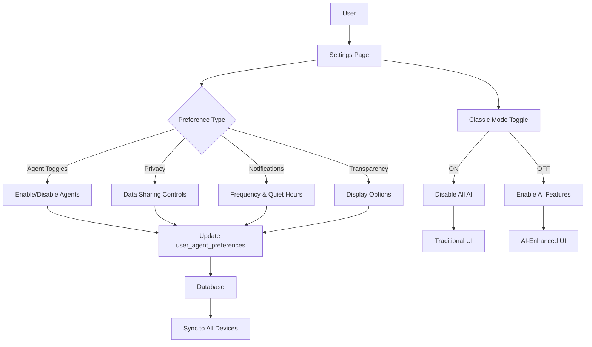

# [Frontend Web] Implement Agent Settings & Privacy Controls

# Implement Agent Settings & Privacy Controls

## Overview
Implement user settings page for agent preferences, privacy controls, and transparency options, giving users full control over AI features.

## Context
User control is essential for trust. This settings page allows users to customize agent behavior, notification preferences, and privacy settings.
  
## Architecture Diagram
  


## Acceptance Criteria

### 1. Agent Preferences
- [ ] Toggle individual agents on/off (booking, session, insights, followup)
- [ ] Set agent autonomy level (ask first, auto-execute, disabled)
- [ ] Configure notification frequency (normal, reduced, minimal)
- [ ] Set quiet hours (no proactive notifications)
- [ ] Save preferences to `user_agent_preferences` table

### 2. Privacy Controls
- [ ] Toggle data sharing with agents (session notes, biometrics)
- [ ] View data usage (what agents accessed)
- [ ] Export agent conversation history
- [ ] Delete agent conversations (right to erasure)
- [ ] Revoke agent permissions

### 3. Transparency Options
- [ ] Toggle confidence scores display
- [ ] Toggle reasoning chains display
- [ ] Toggle tool usage display
- [ ] Set explanation detail level (simple, detailed, technical)
- [ ] View agent activity log

### 4. Classic Mode Toggle
- [ ] Toggle between "AI Mode" and "Classic Mode"
- [ ] Classic Mode disables all AI features
- [ ] Preserve user choice (persist in database)
- [ ] Show comparison (AI vs. Classic features)

### 5. Help & Documentation
- [ ] Link to agent documentation
- [ ] FAQ section (common questions)
- [ ] Video tutorials (how to use agents)
- [ ] Contact support button
- [ ] Feedback form (rate AI experience)

## Technical Details

**Files to Create:**
- `file:web/app/(main)/settings/agents/page.tsx`
- `file:web/components/settings/agent-preferences.tsx`
- `file:web/components/settings/privacy-controls.tsx`
- `file:web/hooks/use-agent-preferences.ts`

**Implementation:**
```typescript
export function AgentPreferences() {
  const { preferences, updatePreferences } = useAgentPreferences();

  return (
    <div className="settings-page">
      <section>
        <h2>Agent Preferences</h2>
        <AgentToggle
          name="BookingAgent"
          description="Helps you book appointments"
          enabled={preferences.enabled_agents.includes('booking')}
          onChange={(enabled) => 
            updatePreferences({ 
              enabled_agents: enabled 
                ? [...preferences.enabled_agents, 'booking']
                : preferences.enabled_agents.filter(a => a !== 'booking')
            })
          }
        />
      </section>

      <section>
        <h2>Privacy Controls</h2>
        {/* Privacy settings */}
      </section>
    </div>
  );
}
```

## Testing
- [ ] Test all toggles (save and load)
- [ ] Test privacy controls (verify enforcement)
- [ ] Test classic mode (all AI disabled)
- [ ] Test data export (verify completeness)
- [ ] Test data deletion (verify removal)

## Success Metrics
- Settings usage rate > 40%
- Classic mode adoption < 10% (most prefer AI)
- Privacy control usage > 30%
- User satisfaction > 4.5/5

## Dependencies
- Database schema (user_agent_preferences)
- Supabase client
  
## Related Specifications
  
- spec:d969320e-d519-47a7-a258-e04789b8ce0e/b4c0579d-02d4-44b4-991b-076b73106254 - Frontend Web Implementation
- spec:d969320e-d519-47a7-a258-e04789b8ce0e/719895d0-e8a7-46cc-b5f9-829428065e26 - UX Patterns & Conversational Interface Design
- spec:d969320e-d519-47a7-a258-e04789b8ce0e/51f8a991-4bf2-4282-98c1-e8d8b4e3d7ee - HIPAA Compliance & Healthcare AI Governance

---

## 📋 DETAILED IMPLEMENTATION [WAVE 4]

**Source:** Wave 4 ticket - Agent settings UI (referenced in notifications step)

**Files to create:**
- `web/app/(main)/settings/agents/page.tsx` - Settings page
- `web/components/settings/agent-preferences.tsx` - Preference toggles
- `web/hooks/use-agent-preferences.ts` - Preferences hook

**Features:**
- Toggle agents on/off
- Notification frequency control
- Quiet hours configuration
- Privacy controls
- Classic mode toggle

**Implementation:** Standard Next.js page with form controls, saves to user_agent_preferences table

**Deploy:** Included in web deployment

**Success:** Usage > 40%, classic mode < 10%

**Wave Progress:** 15/49 updated

