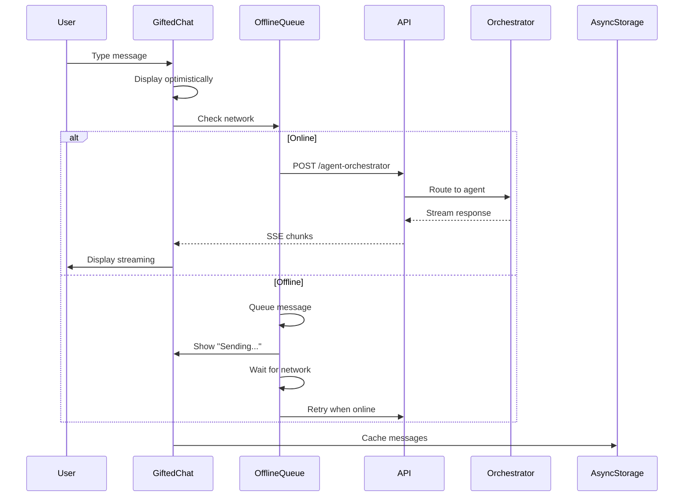

# [Frontend Mobile] Implement AI Chat Component with GiftedChat

# Implement AI Chat Component with GiftedChat

## Overview
Implement the conversational AI chat interface for mobile using react-native-gifted-chat, providing feature parity with the web embedded chat.

## Context
Mobile users need the same conversational AI experience as web users. The implementation uses react-native-gifted-chat for a native, performant chat interface.
  
## Architecture Diagram
  


## Acceptance Criteria

### 1. Chat Component
- [ ] Install `react-native-gifted-chat` dependency
- [ ] Create `AIChat` component
- [ ] Support streaming responses (token-by-token)
- [ ] Display agent status (typing indicator)
- [ ] Custom message bubbles (agent vs. user)

### 2. Quick Actions
- [ ] Bottom sheet with quick action buttons
- [ ] `@book`, `@insights`, `@help` shortcuts
- [ ] Swipe up to reveal quick actions
- [ ] Haptic feedback on selection
- [ ] Keyboard shortcuts (if hardware keyboard)

### 3. Context Awareness
- [ ] Detect current screen (React Navigation)
- [ ] Include screen context in requests
- [ ] Adjust placeholder based on screen
- [ ] Suggest contextual actions

### 4. Offline Support
- [ ] Queue messages when offline
- [ ] Display "Sending..." indicator
- [ ] Retry when back online
- [ ] Store chat history locally (AsyncStorage)
- [ ] Sync with server when online

### 5. Accessibility
- [ ] VoiceOver support (iOS)
- [ ] TalkBack support (Android)
- [ ] Large text support
- [ ] High contrast mode
- [ ] Haptic feedback for actions

## Technical Details

**Files to Create:**
- `file:mobile/src/features/ai/components/AIChat.tsx`
- `file:mobile/src/features/ai/components/QuickActions.tsx`
- `file:mobile/src/features/ai/hooks/useAIChat.ts`
- `file:mobile/src/features/ai/screens/AIChatScreen.tsx`

**Implementation:**
```typescript
import { GiftedChat, IMessage } from 'react-native-gifted-chat';

export function AIChat() {
  const { messages, sendMessage, isLoading } = useAIChat();

  const onSend = useCallback((newMessages: IMessage[] = []) => {
    sendMessage(newMessages[0].text);
  }, []);

  return (
    <GiftedChat
      messages={messages}
      onSend={onSend}
      user={{ _id: userId }}
      renderBubble={renderBubble}
      isTyping={isLoading}
    />
  );
}
```

## Testing
- [ ] Test chat rendering (messages display)
- [ ] Test message sending (API integration)
- [ ] Test offline queue (disconnect network)
- [ ] Test quick actions (all shortcuts)
- [ ] Test accessibility (VoiceOver, TalkBack)

## Success Metrics
- Chat engagement rate > 50%
- Message send latency < 200ms
- Offline queue success rate 100%
- Accessibility score 100%

## Dependencies
- Orchestrator setup
- AsyncStorage
- Network detection
  
## Related Specifications
  
- spec:d969320e-d519-47a7-a258-e04789b8ce0e/339a9b00-068b-4a6c-969d-e84e8bba1ff0 - Frontend Mobile Implementation
- spec:d969320e-d519-47a7-a258-e04789b8ce0e/719895d0-e8a7-46cc-b5f9-829428065e26 - UX Patterns & Conversational Interface Design
- spec:d969320e-d519-47a7-a258-e04789b8ce0e/7dd2bb11-e4c8-4b8d-9f0b-26a8472f3353 - Agentic AI Architecture

---

## 📋 DETAILED IMPLEMENTATION [WAVE 5]

**Source:** Wave 5 ticket (ticket:d969320e-d519-47a7-a258-e04789b8ce0e/3fdf9623-29b8-406a-b79c-ccfa75a88ba4)

### Complete Mobile Chat Implementation

**File:** `mobile/src/services/aiChatService.ts` - See Wave 5 STEP 1.2 for complete AIChatService class

**File:** `mobile/src/screens/AIChatScreen.tsx` - See Wave 5 STEP 1.3 for complete chat screen with GiftedChat

**Key Features:**
- GiftedChat integration with streaming
- Message caching with AsyncStorage
- Haptic feedback on send/receive
- Custom bubbles and send button
- Error handling with toast

**Install:**
```bash
cd mobile
npx expo install react-native-gifted-chat expo-haptics @react-native-async-storage/async-storage
```

**Deploy:** `eas build --platform all`

**Success:** Engagement > 50%, latency < 200ms

**Wave Progress:** 19/49 updated

