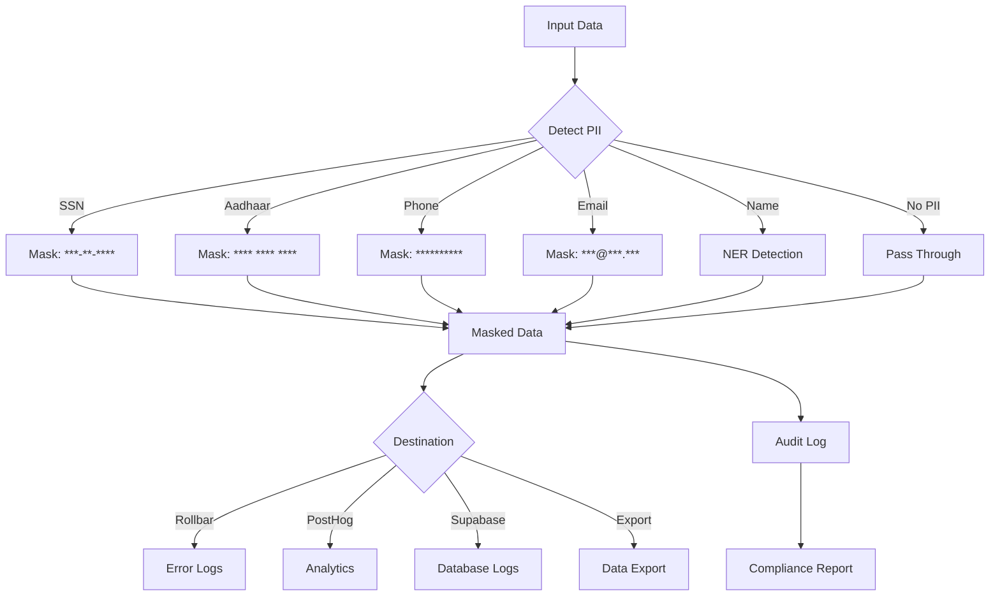

# [Backend] Implement PII Masking & Data Sanitization

# Implement PII Masking & Data Sanitization

## Overview
Implement PII detection and masking for logs, analytics, and error tracking to ensure HIPAA compliance and prevent sensitive data leakage.

## Context
Healthcare applications must protect PHI/PII. This system detects and masks sensitive data before it reaches logs, analytics, or external services.
  
## Architecture Diagram
  


## Acceptance Criteria

### 1. PII Detection
- [ ] Detect SSN (Social Security Numbers)
- [ ] Detect Aadhaar numbers (Indian ID)
- [ ] Detect phone numbers
- [ ] Detect email addresses
- [ ] Detect physical addresses
- [ ] Detect credit card numbers

### 2. Masking Strategy
- [ ] Mask SSN: `***-**-****`
- [ ] Mask Aadhaar: `**** **** ****`
- [ ] Mask phone: `**********`
- [ ] Mask email: `***@***.***`
- [ ] Mask address: `[ADDRESS REDACTED]`
- [ ] Mask credit card: `**** **** **** ****`

### 3. Integration Points
- [ ] Mask in Rollbar error logs
- [ ] Mask in PostHog analytics events
- [ ] Mask in Supabase logs
- [ ] Mask in agent conversation logs
- [ ] Mask in exported data

### 4. Named Entity Recognition (NER)
- [ ] Use NER model for advanced detection
- [ ] Detect person names
- [ ] Detect organization names
- [ ] Detect medical conditions
- [ ] Detect medication names

### 5. Audit & Compliance
- [ ] Log all masking operations
- [ ] Track masking effectiveness
- [ ] Generate compliance reports
- [ ] Test with sample PHI data
- [ ] Verify zero PII leakage

## Technical Details

**Files to Create:**
- `file:mobile/supabase/functions/_shared/pii-masker.ts`
- `file:mobile/supabase/functions/_shared/ner-detector.ts`
- `file:mobile/supabase/functions/pii-audit/index.ts`

**PII Masking:**
```typescript
function maskPII(text: string): string {
  return text
    // SSN
    .replace(/\d{3}-\d{2}-\d{4}/g, '***-**-****')
    // Aadhaar
    .replace(/\d{4}\s\d{4}\s\d{4}/g, '**** **** ****')
    // Phone
    .replace(/\d{10}/g, '**********')
    // Email
    .replace(/[\w.-]+@[\w.-]+\.\w+/g, '***@***.***')
    // Credit Card
    .replace(/\d{4}\s\d{4}\s\d{4}\s\d{4}/g, '**** **** **** ****');
}
```

**Integration with Rollbar:**
```typescript
Rollbar.configure({
  transform: (payload) => {
    if (payload.body.message) {
      payload.body.message.body = maskPII(payload.body.message.body);
    }
    return payload;
  }
});
```

## Testing
- [ ] Test all PII patterns (regex accuracy)
- [ ] Test NER detection (precision/recall)
- [ ] Test integration with Rollbar
- [ ] Test integration with PostHog
- [ ] Test with real PHI samples (anonymized)

## Success Metrics
- PII detection rate > 95%
- False positive rate < 5%
- Masking latency < 10ms
- Zero PII in logs (verified)

## Dependencies
- Rollbar integration
- PostHog integration
- NER model (optional)
  
## Related Specifications
  
- spec:d969320e-d519-47a7-a258-e04789b8ce0e/51f8a991-4bf2-4282-98c1-e8d8b4e3d7ee - HIPAA Compliance & Healthcare AI Governance
- spec:d969320e-d519-47a7-a258-e04789b8ce0e/68139c2e-3473-476b-9d20-8a0f7891ae48 - Backend & Integration Architecture

---

## 📋 DETAILED IMPLEMENTATION [WAVE 3]

**Source:** Wave 3 ticket (ticket:d969320e-d519-47a7-a258-e04789b8ce0e/64b204c2-a72c-4155-9b0d-c6adf81404c4)

### Complete PII Masking Service

**File:** `file:mobile/supabase/functions/_shared/pii-masking.ts`

See Wave 3 ticket STEP 3 for complete PIIMaskingService class with:
- maskText() method for all PII types
- maskConversation() for full conversation masking
- sanitizeForLogging() for recursive object sanitization
- Configurable masking options

**File:** `file:mobile/supabase/functions/mask-pii/index.ts`

Edge Function for on-demand PII masking

**Deployment:**
```bash
cd mobile/supabase/functions
supabase functions new mask-pii
supabase functions deploy mask-pii
```

**Testing:**
```bash
curl -X POST .../mask-pii \
  -d '{"text": "Patient John Doe called from 555-123-4567", "config": {"maskNames": true, "maskPhones": true}}'
```

**Success:** Detection > 95%, false positives < 5%, latency < 100ms

**Wave Progress:** 9/49 updated

