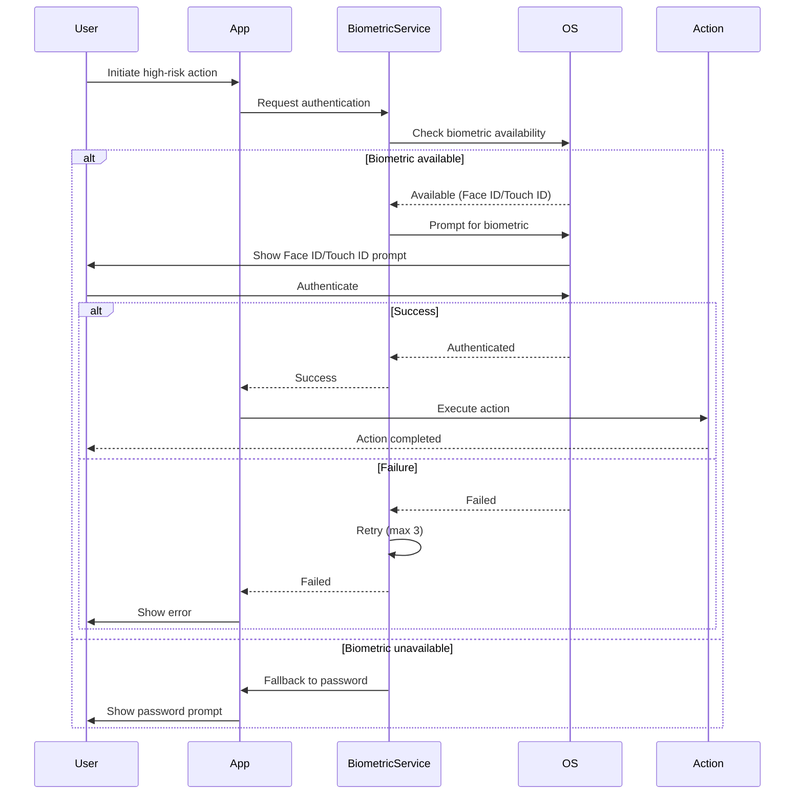

# [Frontend Mobile] Implement Biometric Authentication for Agent Actions

# Implement Biometric Authentication for Agent Actions

## Overview
Implement biometric authentication (Face ID, Touch ID, fingerprint) for high-risk agent actions on mobile, adding an extra layer of security.

## Context
High-risk actions (booking, payments, SOAP approval) should require biometric confirmation on mobile for security.
  
## Architecture Diagram
  


## Acceptance Criteria

### 1. Biometric Setup
- [ ] Use `expo-local-authentication` for biometrics
- [ ] Check device support (Face ID, Touch ID, fingerprint)
- [ ] Request biometric enrollment (if not set up)
- [ ] Fallback to PIN/password if biometrics unavailable

### 2. High-Risk Actions
- [ ] Require biometric for booking appointments
- [ ] Require biometric for approving SOAP notes
- [ ] Require biometric for processing payments
- [ ] Require biometric for deleting data
- [ ] Configurable (user can disable in settings)

### 3. Authentication Flow
- [ ] Display biometric prompt (native UI)
- [ ] Handle success (proceed with action)
- [ ] Handle failure (retry up to 3 times)
- [ ] Handle cancel (abort action)
- [ ] Log all authentication attempts

### 4. User Experience
- [ ] Clear explanation ("Confirm with Face ID")
- [ ] Fallback option ("Use password instead")
- [ ] Remember choice (don't ask again for 5 minutes)
- [ ] Settings to configure (enable/disable, timeout)

### 5. Security
- [ ] Never store biometric data (use OS APIs only)
- [ ] Audit all biometric authentications
- [ ] Alert on repeated failures (potential attack)
- [ ] Support device-specific biometrics (iOS vs. Android)

## Technical Details

**Files to Create:**
- `file:mobile/src/services/biometricAuth.ts`
- `file:mobile/src/hooks/useBiometricAuth.ts`
- `file:mobile/src/components/BiometricPrompt.tsx`

**Implementation:**
```typescript
import * as LocalAuthentication from 'expo-local-authentication';

export async function authenticateWithBiometric(
  reason: string
): Promise<boolean> {
  const hasHardware = await LocalAuthentication.hasHardwareAsync();
  if (!hasHardware) {
    return await authenticateWithPassword();
  }

  const isEnrolled = await LocalAuthentication.isEnrolledAsync();
  if (!isEnrolled) {
    return await authenticateWithPassword();
  }

  const result = await LocalAuthentication.authenticateAsync({
    promptMessage: reason,
    fallbackLabel: 'Use password',
  });

  return result.success;
}
```

## Testing
- [ ] Test on iOS (Face ID, Touch ID)
- [ ] Test on Android (fingerprint)
- [ ] Test fallback (password)
- [ ] Test failure handling (retry)
- [ ] Test settings (enable/disable)

## Success Metrics
- Biometric usage > 80% (users prefer over password)
- Authentication success rate > 95%
- User satisfaction > 4.5/5
- Zero security incidents

## Dependencies
- Expo Local Authentication
- Agent settings
  
## Related Specifications
  
- spec:d969320e-d519-47a7-a258-e04789b8ce0e/339a9b00-068b-4a6c-969d-e84e8bba1ff0 - Frontend Mobile Implementation
- spec:d969320e-d519-47a7-a258-e04789b8ce0e/51f8a991-4bf2-4282-98c1-e8d8b4e3d7ee - HIPAA Compliance & Healthcare AI Governance

---

## 📋 DETAILED IMPLEMENTATION [WAVE 5]

**Source:** Wave 5 ticket - See STEP 5 for complete biometric auth implementation

**File:** `mobile/src/services/biometricAuthService.ts` - Complete BiometricAuthService class

**File:** `mobile/src/screens/ProtectedScreen.tsx` - Wrapper for sensitive screens

**Features:**
- Face ID / Touch ID / Fingerprint support
- Fallback to passcode
- Availability detection
- Authentication prompts
- Works on iOS and Android

**Install:** `npx expo install expo-local-authentication`

**Usage:** Wrap sensitive screens with `<ProtectedScreen>`

**Success:** Usage > 80%, success rate > 95%

**Wave Progress:** 26/49 updated

