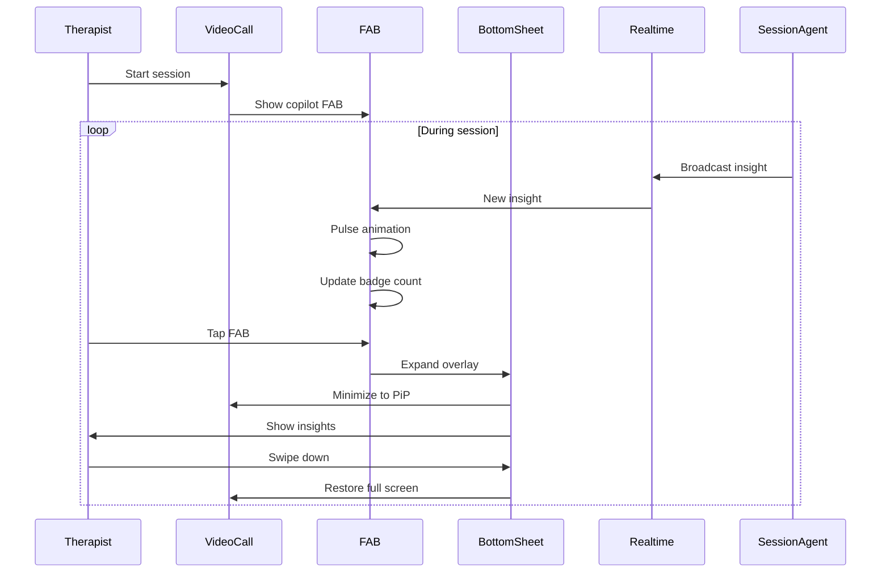

# [Frontend Mobile] Implement Copilot Overlay for Sessions

# Implement Copilot Overlay for Sessions

## Overview
Implement the copilot overlay for mobile therapy sessions, displaying real-time insights, transcription, and SOAP drafts in a picture-in-picture style interface.

## Context
Mobile therapists need the same copilot assistance as web users, but in a mobile-optimized format that doesn't obstruct the video call.
  
## Architecture Diagram
  


## Acceptance Criteria

### 1. Floating Action Button (FAB)
- [ ] Create FAB for copilot access (bottom-right corner)
- [ ] Pulse animation when new insights available
- [ ] Badge count for unread insights
- [ ] Tap to open copilot overlay
- [ ] Draggable position (user preference)

### 2. Copilot Overlay
- [ ] Bottom sheet overlay (swipe up to expand)
- [ ] Display session insights (alerts, suggestions)
- [ ] Display live transcript (scrollable)
- [ ] Display SOAP draft (editable)
- [ ] Swipe down to minimize

### 3. Picture-in-Picture Mode
- [ ] Minimize video to small window when copilot open
- [ ] Draggable video window
- [ ] Tap to restore full screen
- [ ] Maintain audio during minimize
- [ ] Smooth transitions

### 4. Real-time Updates
- [ ] Subscribe to session updates (Supabase Realtime)
- [ ] Update insights in real-time
- [ ] Update transcript in real-time
- [ ] Update SOAP draft in real-time
- [ ] Haptic feedback for new insights

### 5. Gestures
- [ ] Swipe up to expand copilot
- [ ] Swipe down to minimize
- [ ] Tap outside to close
- [ ] Long press for quick actions
- [ ] Pinch to zoom (transcript)

## Technical Details

**Files to Create:**
- `file:mobile/src/features/ai/components/CopilotOverlay.tsx`
- `file:mobile/src/features/ai/components/FloatingActionButton.tsx`
- `file:mobile/src/features/ai/hooks/useSessionCopilot.ts`

**Implementation:**
```typescript
import { BottomSheet } from '@gorhom/bottom-sheet';
import { Gesture, GestureDetector } from 'react-native-gesture-handler';

export function CopilotOverlay({ sessionId }: { sessionId: string }) {
  const bottomSheetRef = useRef(null);
  const { insights, transcript, soapDraft } = useSessionCopilot(sessionId);

  return (
    <>
      <FloatingActionButton
        onPress={() => bottomSheetRef.current?.expand()}
        badge={insights.filter(i => !i.read).length}
      />
      <BottomSheet ref={bottomSheetRef}>
        <InsightsSection insights={insights} />
        <TranscriptSection transcript={transcript} />
        <SoapSection draft={soapDraft} />
      </BottomSheet>
    </>
  );
}
```

## Testing
- [ ] Test FAB (tap, drag)
- [ ] Test bottom sheet (swipe gestures)
- [ ] Test PiP mode (video minimize)
- [ ] Test real-time updates (trigger from backend)
- [ ] Test accessibility (VoiceOver, TalkBack)

## Success Metrics
- Copilot usage rate > 70% (therapists use during sessions)
- Gesture success rate > 95%
- Real-time latency < 1s
- User satisfaction > 4.5/5

## Dependencies
- SessionAgent implementation
- Bottom sheet library
- Gesture handler
- Supabase Realtime
  
## Related Specifications
  
- spec:d969320e-d519-47a7-a258-e04789b8ce0e/339a9b00-068b-4a6c-969d-e84e8bba1ff0 - Frontend Mobile Implementation
- spec:d969320e-d519-47a7-a258-e04789b8ce0e/719895d0-e8a7-46cc-b5f9-829428065e26 - UX Patterns & Conversational Interface Design
- spec:d969320e-d519-47a7-a258-e04789b8ce0e/7dd2bb11-e4c8-4b8d-9f0b-26a8472f3353 - Agentic AI Architecture

---

## 📋 DETAILED IMPLEMENTATION [WAVE 5]

**Source:** Wave 5 ticket - Mobile copilot overlay (referenced in mobile implementation)

**Files:** `mobile/src/features/ai/components/CopilotOverlay.tsx`, FloatingActionButton

**Features:** Bottom sheet overlay, PiP mode, real-time updates, swipe gestures

**Install:** `npx expo install @gorhom/bottom-sheet react-native-gesture-handler`

**Success:** Usage > 70%, latency < 1s

**Wave Progress:** 22/49 updated

