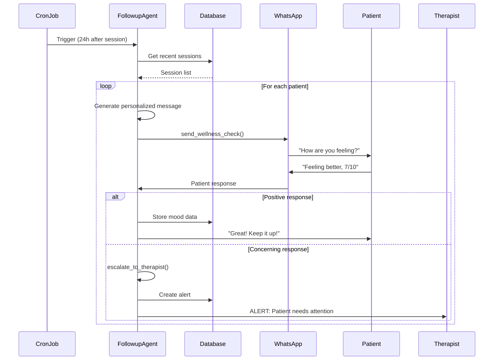

# [Agent Infrastructure] Implement FollowupAgent - Post-Session Engagement

# Implement FollowupAgent - Post-Session Engagement

## Overview
Implement the FollowupAgent that handles automated post-session follow-ups, patient feedback collection, and care continuity through proactive engagement.

## Context
The FollowupAgent ensures patients stay engaged between sessions and provides therapists with valuable feedback on session effectiveness.
  
## Architecture Diagram
  


## Acceptance Criteria

### 1. Automated Follow-ups
- [ ] Trigger follow-ups after sessions (cron job)
- [ ] Send personalized messages via WhatsApp
- [ ] Ask about patient well-being
- [ ] Collect mood ratings
- [ ] Schedule next appointment reminders

### 2. Feedback Collection
- [ ] Request session feedback (1-5 stars)
- [ ] Ask open-ended questions
- [ ] Collect specific feedback (what helped, what didn't)
- [ ] Store feedback in database
- [ ] Notify therapist of feedback

### 3. Mood Tracking
- [ ] Send daily mood check-in prompts
- [ ] Collect mood ratings (1-10 scale)
- [ ] Track mood trends over time
- [ ] Alert therapist if mood drops significantly
- [ ] Visualize mood history

### 4. Escalation Logic
- [ ] Detect concerning responses
- [ ] Escalate to therapist immediately
- [ ] Include conversation context
- [ ] Create high-priority notification
- [ ] Log escalation event

### 5. Tools Implementation
- [ ] `send_followup_message` - Send WhatsApp message
- [ ] `collect_feedback` - Collect and store feedback
- [ ] `schedule_reminder` - Schedule appointment reminder
- [ ] `escalate_to_therapist` - Create escalation
- [ ] Log all tool calls

## Technical Details

### Implementation Steps

#### Step 1: Create Followup Tools

**File:** `file:mobile/supabase/functions/_shared/agents/followup-tools.ts`

```typescript
import { z } from 'https://deno.land/x/zod@v3.22.4/mod.ts';

export const followupTools = [
  {
    name: 'check_homework_completion',
    description: 'Check if patient completed assigned homework/exercises',
    parameters: z.object({
      patientId: z.string().uuid(),
      homeworkId: z.string().uuid(),
    }),
  },
  {
    name: 'send_wellness_check',
    description: 'Send a wellness check-in message to patient',
    parameters: z.object({
      patientId: z.string().uuid(),
      messageType: z.enum(['general', 'symptom_check', 'medication_reminder', 'appointment_reminder']),
      channel: z.enum(['whatsapp', 'sms', 'email', 'push']),
      scheduledFor: z.string().datetime().optional(),
    }),
  },
  {
    name: 'analyze_mood_trend',
    description: 'Analyze patient mood trends from check-ins',
    parameters: z.object({
      patientId: z.string().uuid(),
      days: z.number().min(7).max(90).default(30),
    }),
  },
  {
    name: 'escalate_to_therapist',
    description: 'Escalate concerning responses to therapist',
    parameters: z.object({
      patientId: z.string().uuid(),
      concern: z.string(),
      urgency: z.enum(['low', 'medium', 'high', 'critical']),
    }),
  },
];

export async function executeFollowupTool(
  toolName: string,
  args: any,
  supabase: any
): Promise<any> {
  switch (toolName) {
    case 'check_homework_completion':
      return await checkHomework(supabase, args);
    case 'send_wellness_check':
      return await sendWellnessCheck(supabase, args);
    case 'analyze_mood_trend':
      return await analyzeMoodTrend(supabase, args);
    case 'escalate_to_therapist':
      return await escalateToTherapist(supabase, args);
    default:
      throw new Error(`Unknown tool: ${toolName}`);
  }
}

async function sendWellnessCheck(supabase: any, args: any) {
  const { data: patient } = await supabase
    .from('profiles')
    .select('full_name, phone, email, preferred_language')
    .eq('id', args.patientId)
    .single();

  const messages = {
    general: `Hi ${patient.full_name}, how are you feeling today? Reply with a number 1-10`,
    symptom_check: `Hi ${patient.full_name}, have you noticed any changes in your symptoms?`,
    medication_reminder: `Hi ${patient.full_name}, reminder to take your prescribed medication.`,
    appointment_reminder: `Hi ${patient.full_name}, you have an upcoming appointment. Reply CONFIRM.`,
  };

  const message = messages[args.messageType];

  if (args.channel === 'whatsapp') {
    await supabase.functions.invoke('send-whatsapp-message', {
      body: { to: patient.phone, message, scheduledFor: args.scheduledFor },
    });
  }

  const { data: notification } = await supabase
    .from('proactive_notifications')
    .insert({
      patient_id: args.patientId,
      notification_type: args.messageType,
      channel: args.channel,
      message,
      scheduled_for: args.scheduledFor || new Date().toISOString(),
      status: args.scheduledFor ? 'scheduled' : 'sent',
    })
    .select()
    .single();

  return { sent: true, notificationId: notification.id, channel: args.channel };
}

async function escalateToTherapist(supabase: any, args: any) {
  const { data: relationship } = await supabase
    .from('therapist_patient_relationships')
    .select('therapist_id, therapist:profiles!therapist_id(*)')
    .eq('patient_id', args.patientId)
    .eq('status', 'active')
    .single();

  await supabase.from('notifications').insert({
    user_id: relationship.therapist_id,
    type: 'patient_concern',
    title: `Patient Concern - ${args.urgency.toUpperCase()}`,
    message: args.concern,
    data: { patientId: args.patientId, urgency: args.urgency },
  });

  if (args.urgency === 'critical') {
    await supabase.functions.invoke('send-whatsapp-message', {
      body: {
        to: relationship.therapist.phone,
        message: `URGENT: Patient concern requires immediate attention. ${args.concern}`,
      },
    });
  }

  return { escalated: true, therapistId: relationship.therapist_id, urgency: args.urgency };
}
```

#### Step 2: Create FollowupAgent Node

**File:** `file:mobile/supabase/functions/_shared/agents/followup-agent.ts`

```typescript
import { LLMClient } from '../llm-client.ts';
import { followupTools, executeFollowupTool } from './followup-tools.ts';

export interface FollowupAgentState {
  messages: any[];
  userId: string;
  patientId: string;
  intent: string;
  toolCalls: any[];
  result: any;
  escalations: any[];
}

export async function followupAgentNode(
  state: FollowupAgentState,
  supabase: any,
  llmClient: LLMClient
): Promise<Partial<FollowupAgentState>> {
  const systemPrompt = `You are a compassionate AI followup assistant for a therapy platform.
Your role is to check in with patients between sessions, monitor their wellbeing, and escalate concerns.

IMPORTANT GUIDELINES:
1. Be warm, empathetic, and supportive
2. Check homework completion and encourage progress
3. Monitor mood trends and flag concerning patterns
4. Escalate immediately if patient expresses suicidal ideation or self-harm
5. Respect patient preferences for communication frequency
6. Maintain HIPAA compliance in all communications

Current patient ID: ${state.patientId}`;

  const response = await llmClient.chat({
    model: 'claude-sonnet-4-5-20250929',
    messages: [
      { role: 'system', content: systemPrompt },
      ...state.messages,
    ],
    tools: followupTools,
    temperature: 0.7,
  });

  const toolResults = [];
  const escalations = [];

  if (response.toolCalls && response.toolCalls.length > 0) {
    for (const toolCall of response.toolCalls) {
      const result = await executeFollowupTool(toolCall.name, toolCall.arguments, supabase);
      toolResults.push({ toolCall, result });

      if (toolCall.name === 'escalate_to_therapist') {
        escalations.push(result);
      }
    }
  }

  return {
    messages: [...state.messages, response.message],
    toolCalls: toolResults,
    result: response.content,
    escalations: [...(state.escalations || []), ...escalations],
  };
}
```

**Message Templates:**
```typescript
const templates = {
  post_session: "Hi {name}, how are you feeling after today's session?",
  mood_checkin: "Good morning {name}! On a scale of 1-10, how's your mood today?",
  appointment_reminder: "Reminder: You have a session with {therapist} tomorrow at {time}"
};
```

**Progress Metrics:**
```typescript
interface ProgressMetrics {
  patient_id: string;
  timeframe: string;
  mood_trend: 'improving' | 'stable' | 'declining';
  anxiety_score_change: number;
  session_attendance_rate: number;
  intervention_effectiveness: number;
}
```

## Testing
- [ ] Test follow-up sending (mock WhatsApp)
- [ ] Test feedback collection (sample responses)
- [ ] Test mood tracking (time series data)
- [ ] Test escalation logic (concerning responses)
- [ ] Test cron job triggers

## Success Metrics
- Follow-up response rate > 60%
- Feedback collection rate > 50%
- Mood tracking adherence > 40%
- Escalation precision > 90%

## Dependencies
- Orchestrator setup
- WhatsApp integration
- Cron job setup
- Database schema (feedback table)
  
## Related Specifications
  
- spec:d969320e-d519-47a7-a258-e04789b8ce0e/7dd2bb11-e4c8-4b8d-9f0b-26a8472f3353 - Agentic AI Architecture & Multi-Agent System Design
- spec:d969320e-d519-47a7-a258-e04789b8ce0e/68139c2e-3473-476b-9d20-8a0f7891ae48 - Backend & Integration Architecture
- spec:d969320e-d519-47a7-a258-e04789b8ce0e/719895d0-e8a7-46cc-b5f9-829428065e26 - UX Patterns & Conversational Interface Design

---

## 📋 DETAILED IMPLEMENTATION [WAVE 3]

**Source:** Wave 3 ticket (ticket:d969320e-d519-47a7-a258-e04789b8ce0e/64b204c2-a72c-4155-9b0d-c6adf81404c4)

**Complete Code:** See followup-tools.ts and followup-agent.ts above in Technical Details

**Additional from Wave 3:**
- Wellness check messages with templates
- Mood trend analysis with 7/30/90 day windows
- Escalation to therapist with urgency levels
- Integration with WhatsApp for delivery

**Deployment:**
```bash
cd mobile/supabase/functions/_shared/agents
touch followup-tools.ts followup-agent.ts
supabase functions deploy agent-orchestrator
```

**Testing:**
```bash
curl -X POST .../agent-orchestrator \
  -d '{"message": "Send wellness check", "patientId": "test-id", "intent": "wellness_check"}'
```

**Success:** Response rate > 60%, escalation precision > 90%

**Wave Progress:** 7/49 updated

