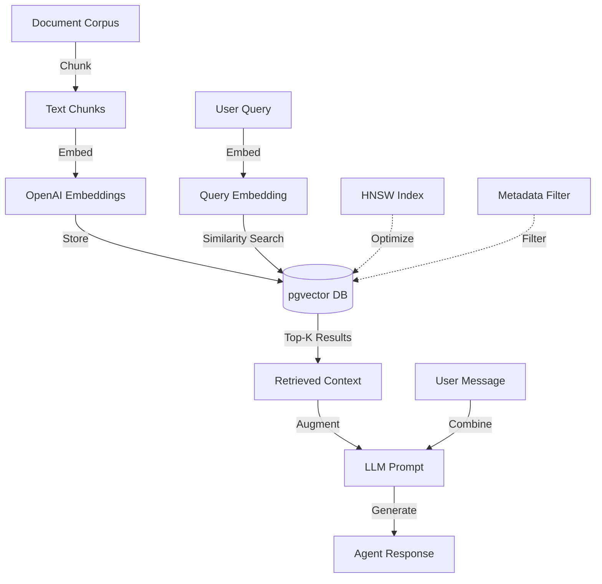

# [Agent Infrastructure] Implement RAG System with pgvector

# Implement RAG System with pgvector

## Overview
Implement the Retrieval-Augmented Generation (RAG) system using pgvector for semantic search over therapy resources, patient history, and clinical protocols.

## Context
RAG enables agents to access relevant context from the knowledge base, improving response accuracy and enabling evidence-based recommendations.
  
## Architecture Diagram
  


## Acceptance Criteria

### 1. pgvector Setup
- [ ] Enable pgvector extension in Supabase
- [ ] Create vector tables for documents
- [ ] Configure indexing (HNSW or IVFFlat)
- [ ] Optimize for query performance
- [ ] Setup backup and recovery

### 2. Document Ingestion
- [ ] Create ingestion pipeline
- [ ] Support document types (PDF, MD, TXT)
- [ ] Chunk documents (512 tokens per chunk)
- [ ] Generate embeddings (OpenAI text-embedding-3-small)
- [ ] Store in agent_memory table

### 3. Knowledge Base
- [ ] Ingest therapy resources (CBT/DBT protocols)
- [ ] Ingest FAQs and common questions
- [ ] Ingest patient history (with consent)
- [ ] Ingest session transcripts
- [ ] Version control for documents

### 4. Semantic Search
- [ ] Implement vector similarity search
- [ ] Use cosine similarity metric
- [ ] Return top-k results (k=5)
- [ ] Include metadata filtering
- [ ] Optimize query latency (< 100ms)

### 5. Retrieval Tool
- [ ] Create `retrieve_context` tool
- [ ] Support query rewriting for better results
- [ ] Implement re-ranking (optional)
- [ ] Cache frequent queries
- [ ] Log all retrievals

## Technical Details

### Implementation Steps

#### Step 1: Create Embedding Service

**File:** `file:mobile/supabase/functions/_shared/embedding-service.ts`

```typescript
import { createClient } from 'https://esm.sh/@supabase/supabase-js@2';

export interface EmbeddingResult {
  embedding: number[];
  model: string;
  usage: { prompt_tokens: number; total_tokens: number };
}

export class EmbeddingService {
  private openaiKey: string;
  
  constructor(openaiKey: string) {
    this.openaiKey = openaiKey;
  }

  async generateEmbedding(text: string): Promise<EmbeddingResult> {
    const response = await fetch('https://api.openai.com/v1/embeddings', {
      method: 'POST',
      headers: {
        'Authorization': `Bearer ${this.openaiKey}`,
        'Content-Type': 'application/json',
      },
      body: JSON.stringify({
        model: 'text-embedding-3-small',
        input: text,
      }),
    });

    if (!response.ok) {
      throw new Error(`Embedding failed: ${response.statusText}`);
    }

    const data = await response.json();
    return {
      embedding: data.data[0].embedding,
      model: data.model,
      usage: data.usage,
    };
  }

  async storeMemory(
    supabase: any,
    userId: string,
    content: string,
    memoryType: 'session_note' | 'patient_goal' | 'therapist_note' | 'conversation',
    metadata: Record<string, any> = {}
  ): Promise<string> {
    const { embedding } = await this.generateEmbedding(content);

    const { data, error } = await supabase
      .from('agent_memory')
      .insert({
        user_id: userId,
        memory_type: memoryType,
        content,
        embedding,
        metadata,
      })
      .select('id')
      .single();

    if (error) throw error;
    return data.id;
  }

  async searchSimilarMemories(
    supabase: any,
    userId: string,
    query: string,
    memoryTypes: string[],
    limit: number = 5,
    similarityThreshold: number = 0.7
  ): Promise<any[]> {
    const { embedding } = await this.generateEmbedding(query);

    const { data, error } = await supabase.rpc('search_agent_memory', {
      query_embedding: embedding,
      query_user_id: userId,
      query_memory_types: memoryTypes,
      match_threshold: similarityThreshold,
      match_count: limit,
    });

    if (error) throw error;
    return data || [];
  }
}
```

#### Step 2: Create RAG Retrieval Edge Function

**File:** `file:mobile/supabase/functions/rag-retrieve/index.ts`

```typescript
import { serve } from 'https://deno.land/std@0.168.0/http/server.ts';
import { createClient } from 'https://esm.sh/@supabase/supabase-js@2';
import { corsHeaders } from '../_shared/cors.ts';
import { EmbeddingService } from '../_shared/embedding-service.ts';
import { reportError } from '../_shared/rollbar.ts';

serve(async (req) => {
  if (req.method === 'OPTIONS') {
    return new Response('ok', { headers: corsHeaders });
  }

  try {
    const { query, userId, memoryTypes, limit = 5 } = await req.json();

    const supabase = createClient(
      Deno.env.get('SUPABASE_URL')!,
      Deno.env.get('SUPABASE_SERVICE_ROLE_KEY')!
    );

    const embeddingService = new EmbeddingService(Deno.env.get('OPENAI_API_KEY')!);

    const memories = await embeddingService.searchSimilarMemories(
      supabase,
      userId,
      query,
      memoryTypes,
      limit
    );

    const context = memories.map((m, idx) => 
      `[${idx + 1}] ${m.memory_type}: ${m.content} (similarity: ${m.similarity.toFixed(2)})`
    ).join('\n\n');

    return new Response(
      JSON.stringify({ 
        success: true, 
        context,
        memories,
        count: memories.length 
      }),
      { headers: { ...corsHeaders, 'Content-Type': 'application/json' } }
    );
  } catch (error) {
    reportError(error, { context: 'rag-retrieve' });
    return new Response(
      JSON.stringify({ success: false, error: error.message }),
      { status: 500, headers: { ...corsHeaders, 'Content-Type': 'application/json' } }
    );
  }
});
```

**Vector Table Schema:**
```sql
CREATE TABLE agent_memory (
  id UUID PRIMARY KEY DEFAULT uuid_generate_v4(),
  user_id UUID NOT NULL REFERENCES auth.users(id),
  memory_type TEXT NOT NULL,
  content TEXT NOT NULL,
  embedding VECTOR(1536),
  metadata JSONB DEFAULT '{}'::jsonb,
  created_at TIMESTAMPTZ DEFAULT NOW()
);

CREATE INDEX ON agent_memory 
USING hnsw (embedding vector_cosine_ops);

CREATE INDEX ON agent_memory(user_id, memory_type);
```

**Retrieval Function:**
```sql
CREATE OR REPLACE FUNCTION search_agent_memory(
  query_embedding VECTOR(1536),
  query_user_id UUID,
  query_memory_types TEXT[],
  match_threshold FLOAT DEFAULT 0.7,
  match_count INT DEFAULT 5
)
RETURNS TABLE (
  id UUID,
  user_id UUID,
  memory_type TEXT,
  content TEXT,
  metadata JSONB,
  similarity FLOAT,
  created_at TIMESTAMPTZ
)
LANGUAGE plpgsql
AS $$
BEGIN
  RETURN QUERY
  SELECT
    am.id,
    am.user_id,
    am.memory_type,
    am.content,
    am.metadata,
    1 - (am.embedding <=> query_embedding) AS similarity,
    am.created_at
  FROM agent_memory am
  WHERE am.user_id = query_user_id
    AND am.memory_type = ANY(query_memory_types)
    AND 1 - (am.embedding <=> query_embedding) > match_threshold
  ORDER BY am.embedding <=> query_embedding
  LIMIT match_count;
END;
$$;
```

## Testing
- [ ] Test document ingestion (sample documents)
- [ ] Test embedding generation (verify dimensions)
- [ ] Test semantic search (relevance)
- [ ] Test query performance (latency)
- [ ] Test with large dataset (10k+ documents)

## Success Metrics
- Retrieval relevance > 80% (manual evaluation)
- Query latency < 100ms (p95)
- Embedding generation < 500ms
- Index size < 1GB (for 10k documents)

## Dependencies
- Supabase database with pgvector
- OpenAI API access
- Document corpus (therapy resources)
  
## Related Specifications
  
- spec:d969320e-d519-47a7-a258-e04789b8ce0e/7dd2bb11-e4c8-4b8d-9f0b-26a8472f3353 - Agentic AI Architecture & Multi-Agent System Design
- spec:d969320e-d519-47a7-a258-e04789b8ce0e/68139c2e-3473-476b-9d20-8a0f7891ae48 - Backend & Integration Architecture

---

## 📋 DETAILED IMPLEMENTATION [WAVE 2]

**Source:** Wave 2 ticket (ticket:d969320e-d519-47a7-a258-e04789b8ce0e/f140acd2-bd7d-40fd-b8b2-f247e357b849)

### Complete RAG Implementation

The code above in Technical Details is complete. Additional notes:

**Deployment:**
```bash
supabase functions new rag-retrieve
supabase functions deploy rag-retrieve
```

**Testing:**
```bash
curl -X POST https://YOUR_PROJECT.supabase.co/functions/v1/rag-retrieve \
  -H "Authorization: Bearer YOUR_ANON_KEY" \
  -d '{"query": "anxiety", "userId": "test-id", "memoryTypes": ["session_note"]}'
```

**Success Criteria:**
- ✅ Similarity search < 100ms
- ✅ Relevance > 80%
- ✅ HNSW index working

**Wave Progress:** 3/49 updated

