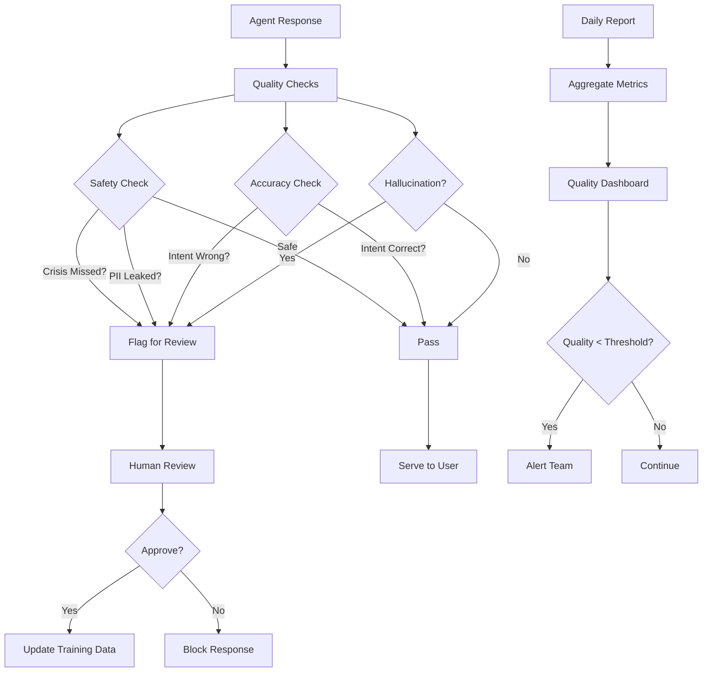

# [Testing] Implement Agent Evaluation & Quality Assurance

# Implement Agent Evaluation & Quality Assurance

## Overview
Implement comprehensive testing and evaluation framework for agents, including hallucination detection, accuracy measurement, and continuous quality monitoring.

## Context
Agent quality directly impacts user trust and safety. This framework ensures agents meet quality standards before and after deployment.
  
## Architecture Diagram
  


## Acceptance Criteria

### 1. Hallucination Detection
- [ ] Random sampling (10% of AI outputs)
- [ ] Human review (therapist or admin)
- [ ] Flag hallucinations (factually incorrect)
- [ ] Track hallucination rate (target < 2%)
- [ ] Alert if rate exceeds threshold

### 2. Accuracy Measurement
- [ ] Test suite with 100 sample conversations
- [ ] Measure intent classification accuracy (target > 90%)
- [ ] Measure tool selection accuracy (target > 95%)
- [ ] Measure SOAP note quality (target > 90%)
- [ ] Measure intervention relevance (target > 80%)

### 3. Safety Testing
- [ ] Test crisis detection (100% recall required)
- [ ] Test PII masking (100% detection required)
- [ ] Test consent enforcement (no unauthorized access)
- [ ] Test data isolation (RLS policies)
- [ ] Penetration testing (quarterly)

### 4. Performance Testing
- [ ] Load testing (1000 concurrent users)
- [ ] Stress testing (10x normal load)
- [ ] Spike testing (sudden traffic surge)
- [ ] Endurance testing (24-hour sustained load)
- [ ] Measure latency under load (p95 < 5s)

### 5. Continuous Monitoring
- [ ] Daily quality reports (automated)
- [ ] Weekly human review (random sampling)
- [ ] Monthly accuracy audits (external review)
- [ ] Quarterly compliance audits (HIPAA)
- [ ] Annual certification (external auditor)

## Technical Details

**Files to Create:**
- `file:tests/agents/hallucination-detector.test.ts`
- `file:tests/agents/accuracy-suite.test.ts`
- `file:tests/agents/safety-suite.test.ts`
- `file:tests/agents/performance-suite.test.ts`
- `file:scripts/run-agent-evaluation.ts`

**Test Suite:**
```typescript
describe('Agent Accuracy Suite', () => {
  const testCases = [
    {
      input: "I want to book an appointment for anxiety",
      expectedIntent: "booking",
      expectedEntities: { specialty: "anxiety" },
    },
    // ... 99 more test cases
  ];

  testCases.forEach((testCase) => {
    it(`classifies intent correctly: ${testCase.input}`, async () => {
      const result = await classifyIntent(testCase.input);
      expect(result.intent).toBe(testCase.expectedIntent);
      expect(result.confidence).toBeGreaterThan(0.8);
    });
  });
});
```

## Testing
- [ ] Run full test suite (100 test cases)
- [ ] Verify all tests pass (100% success)
- [ ] Generate test report (HTML, PDF)
- [ ] Track test coverage (> 80%)
- [ ] Automate in CI/CD pipeline

## Success Metrics
- Test suite pass rate 100%
- Hallucination rate < 2%
- Intent accuracy > 90%
- Safety tests pass rate 100%

## Dependencies
- All agent implementations
- Test data corpus
  
## Related Specifications
  
- spec:d969320e-d519-47a7-a258-e04789b8ce0e/7dd2bb11-e4c8-4b8d-9f0b-26a8472f3353 - Agentic AI Architecture
- spec:d969320e-d519-47a7-a258-e04789b8ce0e/51f8a991-4bf2-4282-98c1-e8d8b4e3d7ee - HIPAA Compliance & Healthcare AI Governance

---

## 📋 DETAILED IMPLEMENTATION [WAVE 7]

**Source:** Wave 7 ticket - Agent evaluation framework

**Features:** Hallucination detection, accuracy measurement, safety testing, performance testing, continuous monitoring

**Files:** `tests/agents/hallucination-detector.test.ts`, `tests/agents/accuracy-suite.test.ts`, `tests/agents/safety-suite.test.ts`

**Test Suite:** 100 sample conversations with expected outputs

**Success:** Pass rate 100%, hallucination < 2%

**Wave Progress:** 38/49 updated

