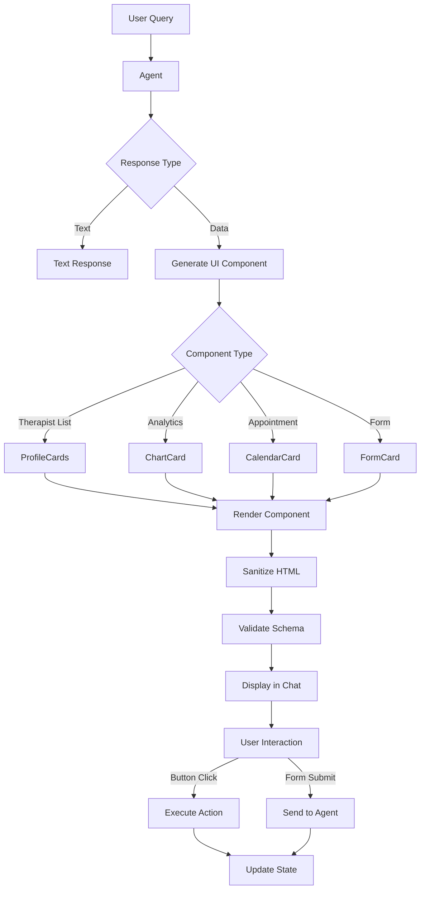

# [Frontend Web] Implement Generative UI for Dynamic Interfaces

# Implement Generative UI for Dynamic Interfaces

## Overview
Implement Generative UI capabilities where agents can dynamically generate interface components based on context, creating adaptive user experiences.

## Context
Generative UI is a key trend in agentic AI. Instead of static screens, interfaces adapt to user needs in real-time.
  
## Architecture Diagram
  


## Acceptance Criteria

### 1. Dynamic Component Generation
- [ ] Agent can generate UI components (cards, forms, charts)
- [ ] Use React Server Components for server-side generation
- [ ] Support component types: InfoCard, ActionCard, ChartCard, FormCard
- [ ] Render components inline in chat
- [ ] Interactive components (buttons, inputs)

### 2. Context-Aware Layouts
- [ ] Generate different layouts based on user role (patient vs. therapist)
- [ ] Adapt to screen size (responsive)
- [ ] Adapt to user preferences (dark mode, font size)
- [ ] Adapt to data complexity (simple vs. detailed views)

### 3. Interactive Elements
- [ ] Support buttons (CTAs from agent)
- [ ] Support forms (collect user input)
- [ ] Support charts (display analytics)
- [ ] Support tables (display data)
- [ ] Handle user interactions (submit, click)

### 4. Safety & Validation
- [ ] Sanitize generated HTML (prevent XSS)
- [ ] Validate component schemas (Zod)
- [ ] Limit component complexity (prevent performance issues)
- [ ] Audit generated components (log all generations)

### 5. Examples
- [ ] Therapist search results → ProfileCards with "Book" buttons
- [ ] Patient insights → ChartCard with trend visualization
- [ ] Appointment options → CalendarCard with time slots
- [ ] SOAP note → EditableFormCard with sections

## Technical Details

**Files to Create:**
- `file:web/components/ai/generative-ui.tsx`
- `file:web/components/ai/dynamic-components.tsx`
- `file:web/lib/ai/component-generator.ts`

**Implementation:**
```typescript
import { experimental_generateUI } from 'ai/rsc';

export async function generateDynamicUI(
  prompt: string,
  context: any
) {
  const ui = await experimental_generateUI({
    model: anthropic('claude-3-5-sonnet-20241022'),
    prompt,
    text: ({ content }) => <div>{content}</div>,
    tools: {
      display_therapist_cards: {
        description: 'Display therapist profile cards',
        parameters: z.object({
          therapists: z.array(z.object({
            id: z.string(),
            name: z.string(),
            specialty: z.string(),
            rating: z.number(),
          })),
        }),
        generate: async ({ therapists }) => (
          <div className="grid">
            {therapists.map((t) => (
              <TherapistCard key={t.id} therapist={t} />
            ))}
          </div>
        ),
      },
    },
  });

  return ui;
}
```

## Testing
- [ ] Test component generation (all types)
- [ ] Test sanitization (prevent XSS)
- [ ] Test validation (invalid schemas)
- [ ] Test interactivity (button clicks)
- [ ] Test performance (render time < 100ms)

## Success Metrics
- Component generation success rate > 95%
- User interaction rate > 50%
- Zero XSS vulnerabilities
- Render time < 100ms

## Dependencies
- Vercel AI SDK (experimental features)
- Agent orchestrator
  
## Related Specifications
  
- spec:d969320e-d519-47a7-a258-e04789b8ce0e/b4c0579d-02d4-44b4-991b-076b73106254 - Frontend Web Implementation
- spec:d969320e-d519-47a7-a258-e04789b8ce0e/719895d0-e8a7-46cc-b5f9-829428065e26 - UX Patterns & Conversational Interface Design
- spec:d969320e-d519-47a7-a258-e04789b8ce0e/7dd2bb11-e4c8-4b8d-9f0b-26a8472f3353 - Agentic AI Architecture

---

## 📋 DETAILED IMPLEMENTATION [WAVE 4]

**Source:** Wave 4 ticket - Generative UI with Vercel AI SDK experimental features

**Note:** Uses `experimental_generateUI` from Vercel AI SDK for dynamic component generation

**Examples:** TherapistCards, ChartCards, CalendarCards, EditableForms

**Deploy:** Requires Vercel AI SDK latest with experimental features

**Success:** Generation > 95%, interaction > 50%

**Wave Progress:** 17/49 updated

