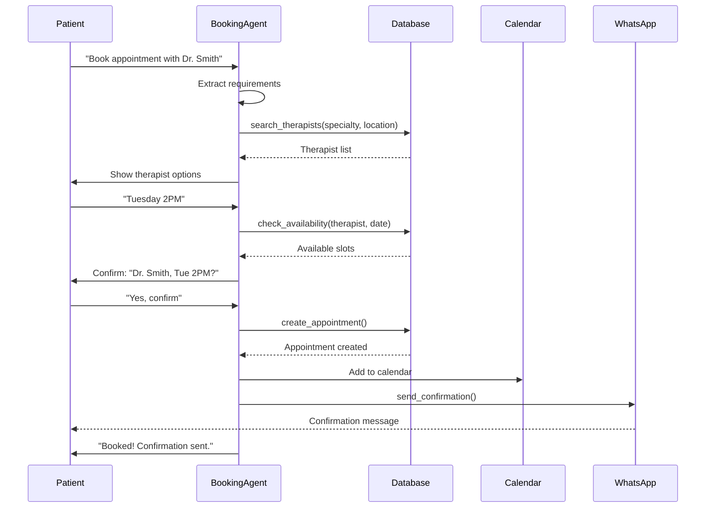

# [Agent Infrastructure] Implement BookingAgent with Tool Calling

# Implement BookingAgent with Tool Calling

## Overview
Implement the BookingAgent that handles appointment scheduling through conversational interface with tool calling for therapist search, availability checking, and booking confirmation.

## Context
The BookingAgent replaces the traditional booking flow with a conversational experience, making it easier for patients to find and book therapists.
  
## Architecture Diagram
  


## Acceptance Criteria

### 1. Agent Implementation
- [ ] Create BookingAgent with LangGraph.js
- [ ] Define system prompt for booking conversations
- [ ] Implement multi-turn conversation handling
- [ ] Support context-aware responses
- [ ] Handle booking edge cases (no availability, conflicts)

### 2. Tool Implementation
- [ ] `search_therapists` - Search by specialty, location, availability
- [ ] `get_availability` - Get therapist's available slots
- [ ] `book_appointment` - Create appointment with confirmation
- [ ] `send_confirmation` - Send WhatsApp/email confirmation
- [ ] Register tools in centralized registry

### 3. Conversation Flow
- [ ] Collect requirements (specialty, date preference, location)
- [ ] Present therapist options with profiles
- [ ] Show available time slots
- [ ] Request booking confirmation
- [ ] Handle user approval/rejection
- [ ] Send confirmation message

### 4. Validation
- [ ] Validate date/time constraints
- [ ] Check therapist availability (real-time)
- [ ] Prevent double booking
- [ ] Validate user permissions
- [ ] Handle timezone conversions

### 5. Error Handling
- [ ] Handle no therapists found
- [ ] Handle no availability
- [ ] Handle booking conflicts
- [ ] Suggest alternatives
- [ ] Escalate to human if needed

## Technical Details

### Implementation Steps

#### Step 1: Create Booking Tools

**File:** `file:mobile/supabase/functions/_shared/agents/booking-tools.ts`

```typescript
import { z } from 'https://deno.land/x/zod@v3.22.4/mod.ts';

export const bookingTools = [
  {
    name: 'check_therapist_availability',
    description: 'Check available time slots for a therapist on a specific date',
    parameters: z.object({
      therapistId: z.string().uuid(),
      date: z.string().regex(/^\d{4}-\d{2}-\d{2}$/),
    }),
  },
  {
    name: 'create_appointment',
    description: 'Create a new appointment booking',
    parameters: z.object({
      patientId: z.string().uuid(),
      therapistId: z.string().uuid(),
      appointmentDate: z.string().datetime(),
      duration: z.number().min(30).max(120),
      notes: z.string().optional(),
    }),
  },
  {
    name: 'send_booking_confirmation',
    description: 'Send confirmation via WhatsApp and email',
    parameters: z.object({
      appointmentId: z.string().uuid(),
      channels: z.array(z.enum(['whatsapp', 'email', 'push'])),
    }),
  },
  {
    name: 'suggest_alternative_slots',
    description: 'Suggest alternative time slots if preferred slot is unavailable',
    parameters: z.object({
      therapistId: z.string().uuid(),
      preferredDate: z.string().regex(/^\d{4}-\d{2}-\d{2}$/),
      flexibilityDays: z.number().min(1).max(14).default(7),
    }),
  },
];

export async function executeBookingTool(
  toolName: string,
  args: any,
  supabase: any
): Promise<any> {
  switch (toolName) {
    case 'check_therapist_availability':
      return await checkAvailability(supabase, args.therapistId, args.date);
    
    case 'create_appointment':
      return await createAppointment(supabase, args);
    
    case 'send_booking_confirmation':
      return await sendConfirmation(supabase, args.appointmentId, args.channels);
    
    case 'suggest_alternative_slots':
      return await suggestAlternatives(supabase, args);
    
    default:
      throw new Error(`Unknown tool: ${toolName}`);
  }
}

async function checkAvailability(supabase: any, therapistId: string, date: string) {
  const { data: appointments } = await supabase
    .from('appointments')
    .select('appointment_date, duration')
    .eq('therapist_id', therapistId)
    .gte('appointment_date', `${date}T00:00:00`)
    .lt('appointment_date', `${date}T23:59:59`)
    .eq('status', 'confirmed');

  const slots = [];
  for (let hour = 9; hour < 18; hour++) {
    const slotTime = `${date}T${hour.toString().padStart(2, '0')}:00:00`;
    const isBooked = appointments?.some(apt => apt.appointment_date === slotTime);
    if (!isBooked) {
      slots.push({ time: slotTime, available: true });
    }
  }

  return { date, therapistId, availableSlots: slots, count: slots.length };
}

async function createAppointment(supabase: any, args: any) {
  const { data, error } = await supabase
    .from('appointments')
    .insert({
      patient_id: args.patientId,
      therapist_id: args.therapistId,
      appointment_date: args.appointmentDate,
      duration: args.duration,
      status: 'confirmed',
      notes: args.notes,
    })
    .select()
    .single();

  if (error) throw error;
  return { success: true, appointment: data };
}

async function sendConfirmation(supabase: any, appointmentId: string, channels: string[]) {
  const { data: appointment } = await supabase
    .from('appointments')
    .select('*, patient:profiles!patient_id(*), therapist:profiles!therapist_id(*)')
    .eq('id', appointmentId)
    .single();

  const results = [];

  for (const channel of channels) {
    if (channel === 'whatsapp') {
      await supabase.functions.invoke('send-whatsapp-message', {
        body: {
          to: appointment.patient.phone,
          message: `Appointment confirmed with ${appointment.therapist.full_name} on ${appointment.appointment_date}`,
        },
      });
      results.push({ channel: 'whatsapp', sent: true });
    }
  }

  return { appointmentId, confirmationsSent: results };
}

async function suggestAlternatives(supabase: any, args: any) {
  const alternatives = [];
  const startDate = new Date(args.preferredDate);

  for (let i = 0; i < args.flexibilityDays; i++) {
    const checkDate = new Date(startDate);
    checkDate.setDate(checkDate.getDate() + i);
    const dateStr = checkDate.toISOString().split('T')[0];

    const availability = await checkAvailability(supabase, args.therapistId, dateStr);
    if (availability.count > 0) {
      alternatives.push({
        date: dateStr,
        slots: availability.availableSlots.slice(0, 3),
      });
    }
  }

  return { alternatives, count: alternatives.length };
}
```

#### Step 2: Create BookingAgent Node

**File:** `file:mobile/supabase/functions/_shared/agents/booking-agent.ts`

```typescript
import { LLMClient } from '../llm-client.ts';
import { bookingTools, executeBookingTool } from './booking-tools.ts';

export interface BookingAgentState {
  messages: any[];
  userId: string;
  intent: string;
  toolCalls: any[];
  result: any;
}

export async function bookingAgentNode(
  state: BookingAgentState,
  supabase: any,
  llmClient: LLMClient
): Promise<Partial<BookingAgentState>> {
  const systemPrompt = `You are a helpful booking assistant for a therapy platform.
Your role is to help patients book appointments with therapists.

Available tools:
- check_therapist_availability: Check available slots
- create_appointment: Book an appointment
- send_booking_confirmation: Send confirmations
- suggest_alternative_slots: Suggest alternatives if preferred slot unavailable

Always:
1. Confirm patient preferences (date, time, therapist)
2. Check availability before booking
3. Send confirmation after successful booking
4. Be empathetic and patient-focused

Current user ID: ${state.userId}`;

  const response = await llmClient.chat({
    model: 'claude-sonnet-4-5-20250929',
    messages: [
      { role: 'system', content: systemPrompt },
      ...state.messages,
    ],
    tools: bookingTools,
    temperature: 0.3,
  });

  const toolResults = [];
  if (response.toolCalls && response.toolCalls.length > 0) {
    for (const toolCall of response.toolCalls) {
      const result = await executeBookingTool(
        toolCall.name,
        toolCall.arguments,
        supabase
      );
      toolResults.push({ toolCall, result });
    }
  }

  return {
    messages: [...state.messages, response.message],
    toolCalls: toolResults,
    result: response.content,
  };
}
```

## Testing
- [ ] Test full booking flow (end-to-end)
- [ ] Test tool calling (all tools)
- [ ] Test validation (edge cases)
- [ ] Test error handling (no availability)
- [ ] Test multi-turn conversations

## Success Metrics
- Booking success rate > 85%
- Average conversation length < 5 turns
- User satisfaction > 4.5/5
- Tool execution success rate > 95%

## Dependencies
- Orchestrator setup
- Tool registry
- WhatsApp integration
- Database schema (appointments table)
  
## Related Specifications
  
- spec:d969320e-d519-47a7-a258-e04789b8ce0e/7dd2bb11-e4c8-4b8d-9f0b-26a8472f3353 - Agentic AI Architecture & Multi-Agent System Design
- spec:d969320e-d519-47a7-a258-e04789b8ce0e/68139c2e-3473-476b-9d20-8a0f7891ae48 - Backend & Integration Architecture

---

## 📋 DETAILED IMPLEMENTATION [WAVE 2]

**Source:** Wave 2 ticket (ticket:d969320e-d519-47a7-a258-e04789b8ce0e/f140acd2-bd7d-40fd-b8b2-f247e357b849)

### Complete BookingAgent Code

The code above in Technical Details is complete. See Wave 2 ticket for:
- booking-tools.ts (lines 40-150)
- booking-agent.ts (lines 155-220)

**Deployment:**
```bash
cd mobile/supabase/functions/_shared/agents
mkdir -p agents
# Copy booking-tools.ts and booking-agent.ts
supabase functions deploy agent-orchestrator
```

**Testing:**
```bash
curl -X POST https://YOUR_PROJECT.supabase.co/functions/v1/agent-orchestrator \
  -d '{"message": "Book with Dr. Smith Tuesday 2PM", "userId": "test-id", "intent": "book_appointment"}'
```

**Success:** Booking success rate > 85%, < 5 turns average

**Wave Progress:** 4/49 updated

