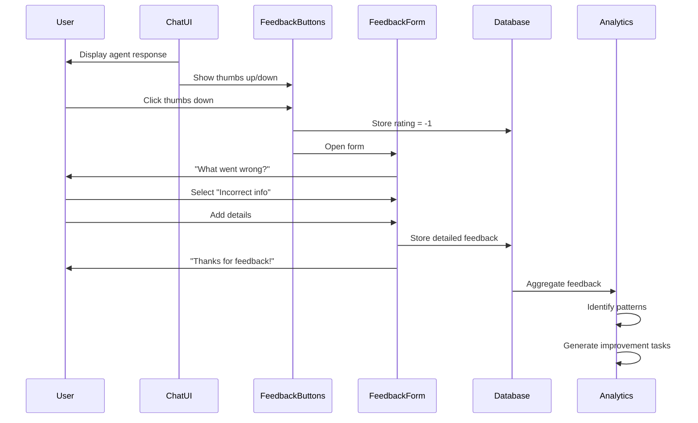

# [UX] Implement AI Feedback Collection System

# Implement AI Feedback Collection System

## Overview
Implement a feedback collection system for AI interactions, including thumbs up/down, detailed feedback forms, and continuous improvement loops.

## Context
User feedback is essential for improving agent quality. This system collects feedback and feeds it back into agent training.
  
## Architecture Diagram
  


## Acceptance Criteria

### 1. Quick Feedback (Thumbs Up/Down)
- [ ] Add thumbs up/down buttons to agent responses
- [ ] Store feedback in database
- [ ] Track feedback rate (% of responses rated)
- [ ] Display aggregate feedback (% positive)
- [ ] Use for agent improvement

### 2. Detailed Feedback Form
- [ ] Trigger on thumbs down (optional)
- [ ] Ask "What went wrong?" (multiple choice + text)
- [ ] Options: Incorrect, Unhelpful, Slow, Confusing, Other
- [ ] Collect specific examples
- [ ] Thank user for feedback

### 3. Feedback Analytics
- [ ] Dashboard for feedback trends
- [ ] Group by agent type
- [ ] Group by issue type
- [ ] Identify common problems
- [ ] Generate improvement recommendations

### 4. Continuous Improvement
- [ ] Weekly review of negative feedback
- [ ] Identify patterns (e.g., "BookingAgent slow")
- [ ] Create improvement tickets
- [ ] Track improvement over time
- [ ] Close feedback loop (notify users of fixes)

### 5. User Incentives
- [ ] Thank users for feedback (in-app message)
- [ ] Highlight impact ("Your feedback improved X")
- [ ] Optional rewards (e.g., free session credit)
- [ ] Leaderboard (top contributors)

## Technical Details

**Files to Create:**
- `file:web/components/ai/feedback-buttons.tsx`
- `file:web/components/ai/feedback-form.tsx`
- `file:web/app/admin/feedback/page.tsx`
- `file:mobile/supabase/migrations/032_agent_feedback.sql`

**Implementation:**
```typescript
export function FeedbackButtons({ messageId }: { messageId: string }) {
  const [rating, setRating] = useState(null);

  const handleFeedback = async (newRating: number) => {
    setRating(newRating);

    await supabase.from('agent_feedback').insert({
      message_id: messageId,
      rating: newRating,
      user_id: userId,
    });

    if (newRating === -1) {
      setShowFeedbackForm(true);
    } else {
      toast.success('Thanks for your feedback!');
    }
  };

  return (
    <div className="feedback-buttons">
      <button onClick={() => handleFeedback(1)}>👍</button>
      <button onClick={() => handleFeedback(-1)}>👎</button>
    </div>
  );
}
```

## Testing
- [ ] Test feedback submission (verify storage)
- [ ] Test feedback form (all issue types)
- [ ] Test analytics (verify calculations)
- [ ] Test improvement tracking (verify trends)
- [ ] A/B test (different feedback prompts)

## Success Metrics
- Feedback rate > 20% (users rate responses)
- Positive feedback > 80%
- Detailed feedback rate > 50% (of negative ratings)
- Improvement velocity (issues resolved per week)

## Dependencies
- Database schema (agent_feedback table)
- Embedded chat component
  
## Related Specifications
  
- spec:d969320e-d519-47a7-a258-e04789b8ce0e/719895d0-e8a7-46cc-b5f9-829428065e26 - UX Patterns & Conversational Interface Design
- spec:d969320e-d519-47a7-a258-e04789b8ce0e/68139c2e-3473-476b-9d20-8a0f7891ae48 - Backend & Integration Architecture

---

## 📋 DETAILED IMPLEMENTATION [WAVE 7]

**Source:** Wave 7 ticket - Feedback collection system

**Features:** Thumbs up/down, detailed feedback form, analytics dashboard, continuous improvement

**Files:** `web/components/ai/feedback-buttons.tsx`, `web/components/ai/feedback-form.tsx`

**Success:** Feedback rate > 20%, positive > 80%

**Wave Progress:** 36/49 updated

