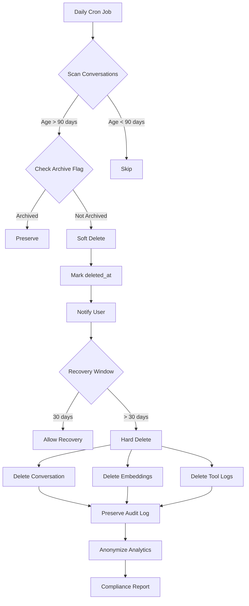

# [Backend] Implement Agent Memory Cleanup & Retention Policies

# Implement Agent Memory Cleanup & Retention Policies

## Overview
Implement automated cleanup and retention policies for agent conversations and memory to comply with HIPAA requirements and optimize storage.

## Context
HIPAA requires specific data retention policies. This system automatically deletes old conversations while preserving audit logs and important data.
  
## Architecture Diagram
  


## Acceptance Criteria

### 1. Retention Policies
- [ ] Delete conversations older than 90 days (HIPAA)
- [ ] Archive important conversations (flagged by user)
- [ ] Retain audit logs for 7 years
- [ ] Delete embeddings with conversations
- [ ] Preserve aggregated analytics (anonymized)

### 2. Soft Delete
- [ ] Implement soft delete (mark as deleted, don't remove)
- [ ] Recovery window: 30 days
- [ ] Hard delete after recovery window
- [ ] Notify user before deletion (7 days warning)
- [ ] Allow user to extend retention

### 3. Cleanup Jobs
- [ ] Daily cron job for cleanup
- [ ] Batch delete (1000 records at a time)
- [ ] Log all deletions (audit trail)
- [ ] Track cleanup metrics (records deleted)
- [ ] Alert on cleanup failures

### 4. User Controls
- [ ] Export conversations before deletion
- [ ] Request immediate deletion (right to erasure)
- [ ] Archive important conversations
- [ ] View retention status
- [ ] Extend retention period

### 5. Compliance
- [ ] Verify HIPAA compliance (90-day retention)
- [ ] Audit trail for all deletions
- [ ] Support data subject requests
- [ ] Generate compliance reports
- [ ] Test with sample data

## Technical Details

**Files to Create:**
- `file:mobile/supabase/functions/cleanup/conversations.ts`
- `file:mobile/supabase/functions/cleanup/memory.ts`
- `file:mobile/supabase/migrations/030_retention_policies.sql`

**Implementation:**
```typescript
export async function cleanupOldConversations() {
  const cutoffDate = new Date();
  cutoffDate.setDate(cutoffDate.getDate() - 90);

  // Soft delete conversations
  const { data } = await supabase
    .from('agent_conversations')
    .update({ deleted_at: new Date().toISOString() })
    .lt('created_at', cutoffDate.toISOString())
    .is('deleted_at', null)
    .is('archived', false);

  // Log deletions
  await logCleanupEvent({
    type: 'conversation_cleanup',
    records_affected: data?.length || 0,
    cutoff_date: cutoffDate,
  });

  return data?.length || 0;
}

export async function hardDeleteExpiredConversations() {
  const cutoffDate = new Date();
  cutoffDate.setDate(cutoffDate.getDate() - 120); // 90 + 30 day recovery

  const { data } = await supabase
    .from('agent_conversations')
    .delete()
    .lt('deleted_at', cutoffDate.toISOString());

  return data?.length || 0;
}
```

## Testing
- [ ] Test soft delete (mark as deleted)
- [ ] Test hard delete (permanent removal)
- [ ] Test recovery (restore within 30 days)
- [ ] Test user export (before deletion)
- [ ] Test compliance (verify retention)

## Success Metrics
- Cleanup success rate 100%
- Zero accidental deletions
- Compliance audit pass rate 100%
- User notification delivery > 95%

## Dependencies
- Database schema (agent_conversations)
- Cron job infrastructure
- Audit logging system
  
## Related Specifications
  
- spec:d969320e-d519-47a7-a258-e04789b8ce0e/51f8a991-4bf2-4282-98c1-e8d8b4e3d7ee - HIPAA Compliance & Healthcare AI Governance
- spec:d969320e-d519-47a7-a258-e04789b8ce0e/68139c2e-3473-476b-9d20-8a0f7891ae48 - Backend & Integration Architecture

---

## 📋 DETAILED IMPLEMENTATION [WAVE 7]

**Source:** Wave 7 ticket - Memory cleanup and retention policies

**Features:** 90-day retention, soft delete with 30-day recovery, hard delete, user controls, HIPAA compliance

**Files:** `mobile/supabase/functions/cleanup/conversations.ts`, `mobile/supabase/functions/cleanup/memory.ts`

**Cron:** Daily cleanup job

**Success:** Cleanup 100%, zero accidental deletions

**Wave Progress:** 41/49 updated

