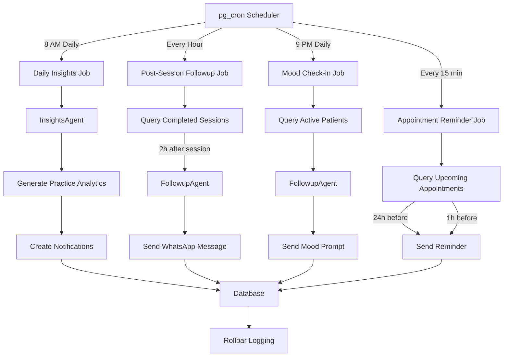

# [Backend] Implement Cron Jobs for Proactive Agents

# Implement Cron Jobs for Proactive Agents

## Overview
Implement scheduled cron jobs that trigger proactive agent actions like daily insights generation, follow-up messages, and appointment reminders.

## Context
Proactive agents need scheduled triggers to initiate conversations at the right time. Cron jobs enable time-based automation.
  
## Architecture Diagram
  


## Acceptance Criteria

### 1. Cron Job Setup
- [ ] Use Supabase pg_cron extension
- [ ] Create cron job management table
- [ ] Schedule daily insights (8 AM)
- [ ] Schedule follow-ups (after sessions)
- [ ] Schedule mood check-ins (9 PM)

### 2. Daily Insights Generation
- [ ] Trigger InsightsAgent for all therapists
- [ ] Generate practice analytics
- [ ] Identify patients needing attention
- [ ] Create proactive notifications
- [ ] Send via push/WhatsApp

### 3. Post-Session Follow-ups
- [ ] Detect completed sessions
- [ ] Wait 2 hours after session
- [ ] Trigger FollowupAgent
- [ ] Send personalized message
- [ ] Collect feedback

### 4. Appointment Reminders
- [ ] Check upcoming appointments (24h, 1h)
- [ ] Send WhatsApp reminders
- [ ] Include session details
- [ ] Handle timezone conversions
- [ ] Track reminder delivery

### 5. Mood Check-ins
- [ ] Send daily mood prompts (9 PM)
- [ ] Collect mood ratings (1-10)
- [ ] Store in database
- [ ] Alert therapist if mood drops
- [ ] Visualize trends

## Technical Details

**Files to Create:**
- `file:mobile/supabase/migrations/027_setup_cron_jobs.sql`
- `file:mobile/supabase/functions/agent-cron/daily-insights.ts`
- `file:mobile/supabase/functions/agent-cron/post-session-followup.ts`
- `file:mobile/supabase/functions/agent-cron/appointment-reminders.ts`
- `file:mobile/supabase/functions/agent-cron/mood-checkins.ts`

**Cron Job Setup:**
```sql
-- Enable pg_cron
CREATE EXTENSION IF NOT EXISTS pg_cron;

-- Daily insights (8 AM IST)
SELECT cron.schedule(
  'daily-insights',
  '0 8 * * *',
  $$
  SELECT net.http_post(
    url := 'https://your-project.supabase.co/functions/v1/agent-cron/daily-insights',
    headers := '{"Authorization": "Bearer ' || current_setting('app.service_role_key') || '"}'::jsonb
  );
  $$
);

-- Post-session follow-ups (every hour)
SELECT cron.schedule(
  'post-session-followups',
  '0 * * * *',
  $$
  SELECT net.http_post(
    url := 'https://your-project.supabase.co/functions/v1/agent-cron/post-session-followup',
    headers := '{"Authorization": "Bearer ' || current_setting('app.service_role_key') || '"}'::jsonb
  );
  $$
);
```

**Follow-up Logic:**
```typescript
async function triggerPostSessionFollowups() {
  // Find sessions completed 2 hours ago
  const sessions = await supabase
    .from('sessions')
    .select('*')
    .eq('status', 'completed')
    .gte('ended_at', new Date(Date.now() - 3 * 60 * 60 * 1000))
    .lte('ended_at', new Date(Date.now() - 2 * 60 * 60 * 1000))
    .is('followup_sent', false);
  
  for (const session of sessions.data) {
    await triggerFollowupAgent(session);
    
    await supabase
      .from('sessions')
      .update({ followup_sent: true })
      .eq('id', session.id);
  }
}
```

## Testing
- [ ] Test cron job scheduling
- [ ] Test daily insights generation
- [ ] Test follow-up triggers
- [ ] Test appointment reminders
- [ ] Test mood check-ins

## Success Metrics
- Cron job reliability > 99.9%
- Follow-up delivery rate > 95%
- Reminder delivery rate > 98%
- Mood check-in response rate > 40%

## Dependencies
- Supabase pg_cron extension
- Agent orchestrator
- WhatsApp integration
- Database schema (sessions, notifications)
  
## Related Specifications
  
- spec:d969320e-d519-47a7-a258-e04789b8ce0e/68139c2e-3473-476b-9d20-8a0f7891ae48 - Backend & Integration Architecture
- spec:d969320e-d519-47a7-a258-e04789b8ce0e/7dd2bb11-e4c8-4b8d-9f0b-26a8472f3353 - Agentic AI Architecture

---

## 📋 DETAILED IMPLEMENTATION [WAVE 3]

**Source:** Wave 3 ticket (ticket:d969320e-d519-47a7-a258-e04789b8ce0e/64b204c2-a72c-4155-9b0d-c6adf81404c4)

### Proactive Agent Cron Handler

**File:** `file:mobile/supabase/functions/proactive-agent-cron/index.ts`

See Wave 3 ticket STEP 4 for complete cron handler that:
- Processes scheduled messages every 15 minutes
- Triggers daily wellness checks based on user preferences
- Sends homework reminders for overdue tasks
- Handles errors gracefully
- Logs all activities to Rollbar

**Configuration:** `file:mobile/supabase/config.toml`
```toml
[functions.proactive-agent-cron]
verify_jwt = false

[[functions.proactive-agent-cron.cron]]
schedule = "*/15 * * * *"  # Every 15 minutes
```

**Deployment:**
```bash
supabase functions deploy proactive-agent-cron
```

**Testing:**
```bash
# Manual trigger
curl -X POST .../proactive-agent-cron -H "Authorization: Bearer SERVICE_ROLE_KEY"
```

**Success:** Reliability > 99.9%, delivery > 95%

**Wave Progress:** 10/49 updated

