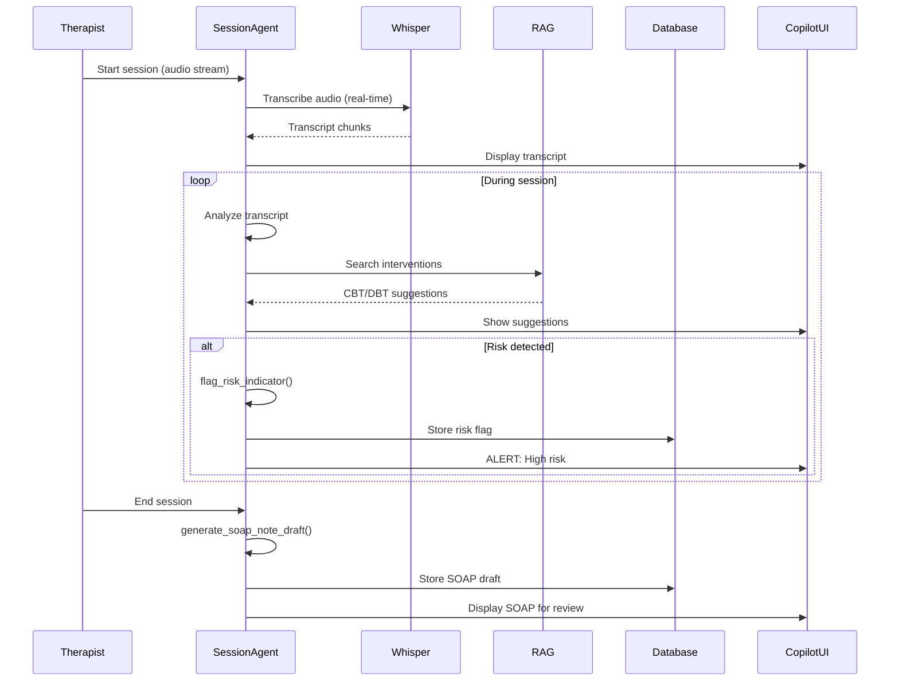

# [Agent Infrastructure] Implement SessionAgent - Real-time Copilot

# Implement SessionAgent - Real-time Copilot

## Overview
Implement the SessionAgent that provides real-time copilot assistance during therapy sessions with live transcription, intervention suggestions, SOAP note generation, and risk detection.

## Context
The SessionAgent enhances therapist effectiveness by providing real-time insights, suggestions, and automated documentation during sessions.
  
## Architecture Diagram
  


## Acceptance Criteria

### 1. Real-time Transcription
- [ ] Stream audio from Daily.co to SessionAgent
- [ ] Use OpenAI Whisper API for transcription
- [ ] Support Hinglish language
- [ ] Emit transcription chunks via Supabase Realtime
- [ ] Store complete transcript in database

### 2. Intervention Suggestions
- [ ] Implement RAG with CBT/DBT knowledge base
- [ ] Analyze transcript for therapeutic opportunities
- [ ] Suggest evidence-based interventions
- [ ] Display suggestions in copilot sidebar
- [ ] Track suggestion acceptance rate

### 3. SOAP Note Generation
- [ ] Generate SOAP notes in real-time (streaming)
- [ ] Use Claude 3.5 Sonnet for clinical reasoning
- [ ] Stream sections (Subjective, Objective, Assessment, Plan)
- [ ] Include ICD-10 code suggestions
- [ ] Mark as draft (requires therapist approval)

### 4. Risk Detection
- [ ] Implement keyword detection for self-harm
- [ ] Use sentiment analysis for mood assessment
- [ ] Flag high-risk content immediately
- [ ] Create alert in proactive_notifications
- [ ] Escalate to therapist with context

### 5. Tools Implementation
- [ ] `transcribe_audio_stream` - Real-time transcription
- [ ] `suggest_intervention` - CBT/DBT suggestions
- [ ] `generate_soap_section` - Streaming SOAP
- [ ] `detect_risk` - Risk assessment
- [ ] Log all tool calls

## Technical Details

### Implementation Steps

#### Step 1: Create Session Tools

**File:** `file:mobile/supabase/functions/_shared/agents/session-tools.ts`

```typescript
import { z } from 'https://deno.land/x/zod@v3.22.4/mod.ts';

export const sessionTools = [
  {
    name: 'retrieve_patient_history',
    description: 'Retrieve relevant patient history and previous session notes',
    parameters: z.object({
      patientId: z.string().uuid(),
      lookbackDays: z.number().min(7).max(365).default(90),
    }),
  },
  {
    name: 'suggest_intervention',
    description: 'Suggest therapeutic interventions based on current conversation',
    parameters: z.object({
      symptoms: z.array(z.string()),
      therapyType: z.enum(['CBT', 'DBT', 'ACT', 'Psychodynamic', 'Humanistic']),
      sessionGoal: z.string(),
    }),
  },
  {
    name: 'flag_risk_indicator',
    description: 'Flag potential risk indicators (suicidal ideation, self-harm, etc.)',
    parameters: z.object({
      riskType: z.enum(['suicidal_ideation', 'self_harm', 'substance_abuse', 'violence']),
      severity: z.enum(['low', 'medium', 'high', 'critical']),
      evidence: z.string(),
    }),
  },
  {
    name: 'generate_soap_note_draft',
    description: 'Generate a draft SOAP note from session transcript',
    parameters: z.object({
      transcript: z.string(),
      sessionId: z.string().uuid(),
    }),
  },
];

export async function executeSessionTool(
  toolName: string,
  args: any,
  supabase: any,
  embeddingService: any
): Promise<any> {
  switch (toolName) {
    case 'retrieve_patient_history':
      return await retrieveHistory(supabase, embeddingService, args);
    case 'suggest_intervention':
      return await suggestIntervention(args);
    case 'flag_risk_indicator':
      return await flagRisk(supabase, args);
    case 'generate_soap_note_draft':
      return await generateSOAPDraft(supabase, args);
    default:
      throw new Error(`Unknown tool: ${toolName}`);
  }
}

async function retrieveHistory(supabase: any, embeddingService: any, args: any) {
  const memories = await embeddingService.searchSimilarMemories(
    supabase,
    args.patientId,
    'patient history and previous sessions',
    ['session_note', 'patient_goal', 'therapist_note'],
    10
  );

  return {
    patientId: args.patientId,
    relevantHistory: memories.map(m => ({
      type: m.memory_type,
      content: m.content,
      date: m.created_at,
      similarity: m.similarity,
    })),
  };
}

async function suggestIntervention(args: any) {
  const interventions = {
    CBT: [
      'Cognitive restructuring: Challenge negative automatic thoughts',
      'Behavioral activation: Schedule pleasant activities',
      'Exposure therapy: Gradual exposure to feared situations',
    ],
    DBT: [
      'Mindfulness: Practice present-moment awareness',
      'Distress tolerance: Use TIPP skills',
      'Emotion regulation: Identify and label emotions',
    ],
    ACT: [
      'Acceptance: Practice willingness to experience difficult thoughts',
      'Cognitive defusion: Create distance from thoughts',
      'Values clarification: Identify what matters most',
    ],
  };

  return {
    therapyType: args.therapyType,
    symptoms: args.symptoms,
    suggestedInterventions: interventions[args.therapyType] || [],
    sessionGoal: args.sessionGoal,
  };
}

async function flagRisk(supabase: any, args: any) {
  const { data, error } = await supabase
    .from('risk_flags')
    .insert({
      risk_type: args.riskType,
      severity: args.severity,
      evidence: args.evidence,
      flagged_at: new Date().toISOString(),
    })
    .select()
    .single();

  if (error) throw error;

  if (args.severity === 'critical') {
    await supabase.functions.invoke('send-emergency-alert', {
      body: { riskFlag: data },
    });
  }

  return { flagged: true, riskFlag: data };
}

async function generateSOAPDraft(supabase: any, args: any) {
  const { data, error } = await supabase.functions.invoke('generate-soap-note', {
    body: {
      transcript: args.transcript,
      sessionId: args.sessionId,
    },
  });

  if (error) throw error;
  return { soapNote: data, sessionId: args.sessionId };
}
```

#### Step 2: Create SessionAgent Node

**File:** `file:mobile/supabase/functions/_shared/agents/session-agent.ts`

```typescript
import { LLMClient } from '../llm-client.ts';
import { EmbeddingService } from '../embedding-service.ts';
import { sessionTools, executeSessionTool } from './session-tools.ts';

export interface SessionAgentState {
  messages: any[];
  userId: string;
  sessionId: string;
  patientId: string;
  therapistId: string;
  intent: string;
  toolCalls: any[];
  result: any;
  riskFlags: any[];
}

export async function sessionAgentNode(
  state: SessionAgentState,
  supabase: any,
  llmClient: LLMClient,
  embeddingService: EmbeddingService
): Promise<Partial<SessionAgentState>> {
  const patientContext = await embeddingService.searchSimilarMemories(
    supabase,
    state.patientId,
    'patient background and treatment history',
    ['session_note', 'patient_goal', 'therapist_note'],
    5
  );

  const contextSummary = patientContext.map(m => `- ${m.content}`).join('\n');

  const systemPrompt = `You are an AI copilot assisting a therapist during a live therapy session.
Your role is to provide real-time suggestions, flag risks, and help with documentation.

IMPORTANT GUIDELINES:
1. NEVER provide direct advice to the patient - only assist the therapist
2. Flag any risk indicators immediately (suicidal ideation, self-harm, etc.)
3. Suggest evidence-based interventions appropriate to the therapy modality
4. Be concise - therapists need quick, actionable insights
5. Maintain HIPAA compliance - all data is encrypted and logged

Patient Context:
${contextSummary}

Current session ID: ${state.sessionId}
Therapist ID: ${state.therapistId}
Patient ID: ${state.patientId}`;

  const response = await llmClient.chat({
    model: 'claude-opus-4-5-20251101',
    messages: [
      { role: 'system', content: systemPrompt },
      ...state.messages,
    ],
    tools: sessionTools,
    temperature: 0.2,
  });

  const toolResults = [];
  const riskFlags = [];

  if (response.toolCalls && response.toolCalls.length > 0) {
    for (const toolCall of response.toolCalls) {
      const result = await executeSessionTool(
        toolCall.name,
        toolCall.arguments,
        supabase,
        embeddingService
      );
      toolResults.push({ toolCall, result });

      if (toolCall.name === 'flag_risk_indicator') {
        riskFlags.push(result.riskFlag);
      }
    }
  }

  return {
    messages: [...state.messages, response.message],
    toolCalls: toolResults,
    result: response.content,
    riskFlags: [...(state.riskFlags || []), ...riskFlags],
  };
}
```

**Risk Keywords:**
```typescript
const RISK_KEYWORDS = [
  'suicide', 'kill myself', 'end it all', 
  'self-harm', 'hurt myself', 'no reason to live'
];
```

## Testing
- [ ] Test real-time transcription (mock audio)
- [ ] Test intervention suggestions (sample transcripts)
- [ ] Test SOAP generation (10 sample sessions)
- [ ] Test risk detection (positive/negative cases)
- [ ] E2E test (full session flow)

## Success Metrics
- Transcription accuracy > 95% (Hinglish)
- Intervention relevance > 80%
- SOAP note quality > 90% (minimal edits)
- Risk detection recall > 99%

## Dependencies
- Orchestrator setup
- RAG system
- Daily.co integration
- Database schema (sessions table)
  
## Related Specifications
  
- spec:d969320e-d519-47a7-a258-e04789b8ce0e/7dd2bb11-e4c8-4b8d-9f0b-26a8472f3353 - Agentic AI Architecture & Multi-Agent System Design
- spec:d969320e-d519-47a7-a258-e04789b8ce0e/68139c2e-3473-476b-9d20-8a0f7891ae48 - Backend & Integration Architecture
- spec:d969320e-d519-47a7-a258-e04789b8ce0e/51f8a991-4bf2-4282-98c1-e8d8b4e3d7ee - HIPAA Compliance & Healthcare AI Governance

---

## 📋 DETAILED IMPLEMENTATION [WAVE 2]

**Source:** Wave 2 ticket - See complete session-tools.ts and session-agent.ts code above in Technical Details

**Deployment:** Create files in `mobile/supabase/functions/_shared/agents/`, deploy orchestrator

**Testing:** `curl -X POST .../agent-orchestrator -d '{"message": "Patient expressing hopelessness", "intent": "risk_assessment"}'`

**Success:** Risk detection recall > 99%, intervention relevance > 80%

**Wave Progress:** 5/49 updated

