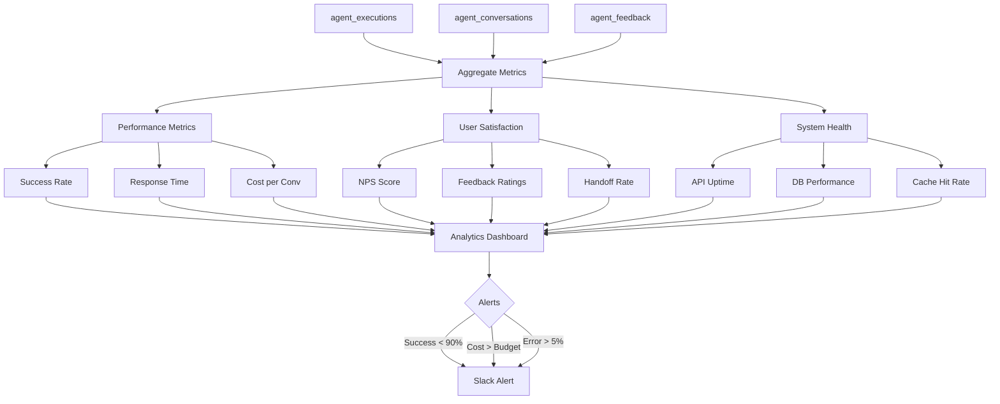

# [Backend] Implement Agent Performance Analytics Dashboard

# Implement Agent Performance Analytics Dashboard

## Overview
Create an analytics dashboard for monitoring agent performance, including success rates, response times, costs, user satisfaction, and system health metrics.

## Context
Monitoring agent health is critical for maintaining quality and identifying issues early. The dashboard provides real-time visibility into agent performance.
  
## Architecture Diagram
  


## Acceptance Criteria

### 1. Performance Metrics
- [ ] Agent success rate (% of conversations achieving goal)
- [ ] Average response time (p50, p95, p99)
- [ ] Cost per conversation
- [ ] Token usage per conversation
- [ ] Error rate by agent type

### 2. User Satisfaction Metrics
- [ ] NPS score (Net Promoter Score)
- [ ] Feedback ratings (thumbs up/down %)
- [ ] Handoff rate (% escalated to human)
- [ ] Feature adoption rate
- [ ] User retention

### 3. System Health Metrics
- [ ] API availability (uptime %)
- [ ] Database query performance
- [ ] Edge Function latency
- [ ] Cache hit rate
- [ ] Queue depth (offline messages)

### 4. Visualizations
- [ ] Time series charts (trends over time)
- [ ] Bar charts (comparison by agent type)
- [ ] Pie charts (distribution)
- [ ] Heatmaps (usage patterns)
- [ ] Real-time counters (active conversations)

### 5. Alerts & Notifications
- [ ] Alert if success rate < 90%
- [ ] Alert if response time > 5s
- [ ] Alert if cost > budget
- [ ] Alert if error rate > 5%
- [ ] Send to Slack/email

## Technical Details

**Files to Create:**
- `file:web/app/admin/analytics/page.tsx`
- `file:web/components/analytics/performance-chart.tsx`
- `file:web/components/analytics/metrics-card.tsx`
- `file:mobile/supabase/functions/analytics/aggregate.ts`

**Implementation:**
```typescript
export function PerformanceDashboard() {
  const { metrics, loading } = useAgentMetrics();

  return (
    <div className="dashboard">
      <MetricsGrid>
        <MetricCard
          title="Success Rate"
          value={`${metrics.successRate}%`}
          trend={metrics.successRateTrend}
          target={90}
        />
        <MetricCard
          title="Avg Response Time"
          value={`${metrics.avgResponseTime}s`}
          trend={metrics.responseTrend}
          target={2}
        />
        <MetricCard
          title="Cost per Conversation"
          value={`$${metrics.costPerConv}`}
          trend={metrics.costTrend}
          target={0.5}
        />
      </MetricsGrid>

      <PerformanceChart data={metrics.timeSeries} />
      <AgentComparison data={metrics.byAgent} />
    </div>
  );
}
```

## Testing
- [ ] Test metric calculations (verify accuracy)
- [ ] Test visualizations (render correctly)
- [ ] Test alerts (trigger conditions)
- [ ] Test real-time updates
- [ ] Load test (large datasets)

## Success Metrics
- Dashboard load time < 2s
- Metric accuracy 100%
- Alert delivery < 1 minute
- User engagement > 50% (daily views)

## Dependencies
- Database schema (agent_executions, agent_analytics)
- Chart library (Recharts or similar)
  
## Related Specifications
  
- spec:d969320e-d519-47a7-a258-e04789b8ce0e/68139c2e-3473-476b-9d20-8a0f7891ae48 - Backend & Integration Architecture
- spec:d969320e-d519-47a7-a258-e04789b8ce0e/b4c0579d-02d4-44b4-991b-076b73106254 - Frontend Web Implementation

---

## 📋 DETAILED IMPLEMENTATION [WAVE 7]

**Source:** Wave 7 ticket - Performance analytics dashboard

**Features:** Success rate, response time, cost tracking, user satisfaction, system health metrics with visualizations

**Files:** `web/app/admin/analytics/page.tsx`, performance-chart.tsx, metrics-card.tsx

**Success:** Load < 2s, accuracy 100%

**Wave Progress:** 40/49 updated

