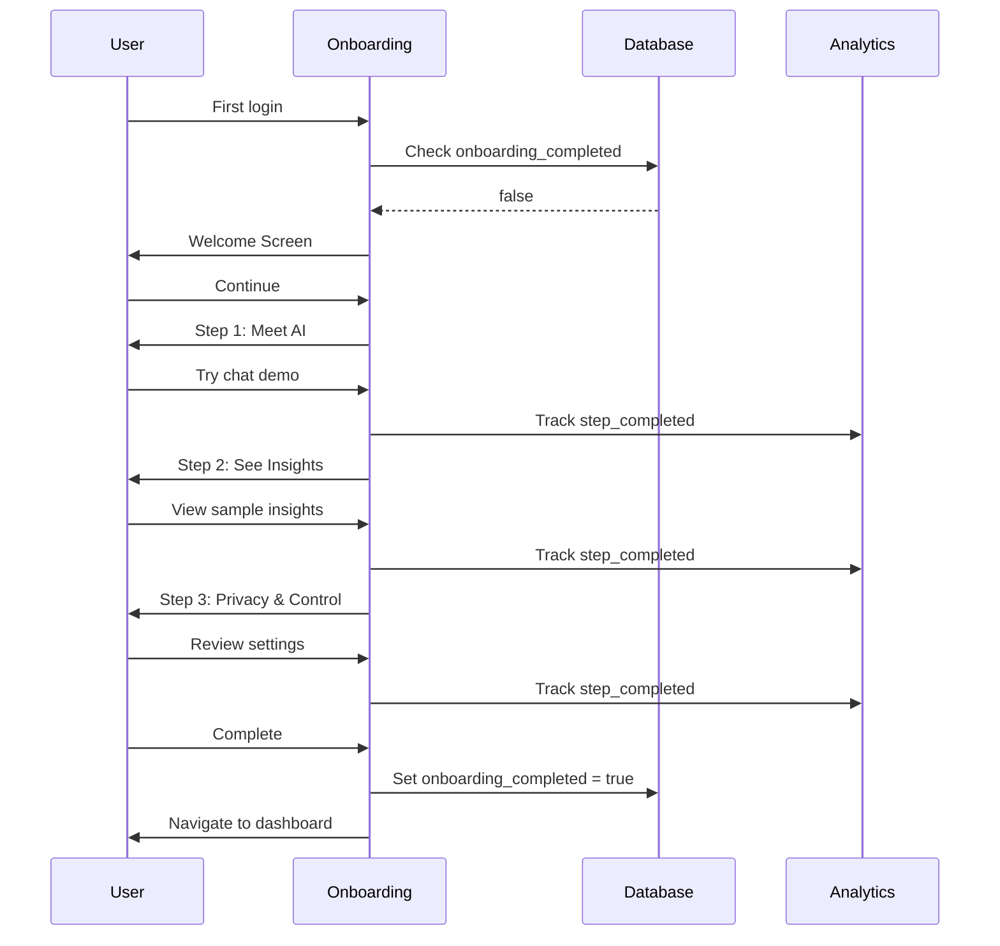

# [UX] Design & Implement Onboarding Flow for AI Features

# Design & Implement Onboarding Flow for AI Features

## Overview
Design and implement an onboarding flow that introduces users to AI features, sets expectations, and builds trust through interactive tutorials.

## Context
Users need to understand what AI can do, how to use it, and when to trust it. Good onboarding increases adoption and reduces confusion.
  
## Architecture Diagram
  


## Acceptance Criteria

### 1. Welcome Screen
- [ ] Introduce AI assistant concept
- [ ] Explain benefits (time savings, better insights)
- [ ] Set expectations (AI assists, human decides)
- [ ] Show example interactions
- [ ] Skip button (for returning users)

### 2. Interactive Tutorial
- [ ] Step 1: Try the embedded chat ("Ask me to find a therapist")
- [ ] Step 2: Use quick actions ("Try @book")
- [ ] Step 3: View transparency ("See how I decided")
- [ ] Step 4: Customize settings ("Set your preferences")
- [ ] Progress indicator (4 steps)

### 3. Trust Building
- [ ] Explain HIPAA compliance ("Your data is encrypted")
- [ ] Explain human oversight ("Therapists review all notes")
- [ ] Explain transparency ("You can always see why")
- [ ] Explain control ("You can disable anytime")
- [ ] Link to privacy policy

### 4. Agent Introduction
- [ ] Introduce each agent (booking, session, insights, followup)
- [ ] Show agent capabilities (what it can do)
- [ ] Show agent limitations (what it can't do)
- [ ] Provide usage examples
- [ ] Allow selective enabling

### 5. Completion & Tracking
- [ ] Mark onboarding as completed
- [ ] Store in `user_agent_preferences` table
- [ ] Track completion rate (target > 80%)
- [ ] Track time to complete (target < 5 minutes)
- [ ] Allow re-watch (help menu)

## Technical Details

**Files to Create:**
- `file:web/app/(onboarding)/ai-intro/page.tsx`
- `file:mobile/src/features/onboarding/screens/AIIntroScreen.tsx`
- `file:web/components/onboarding/interactive-tutorial.tsx`

**Implementation:**
```typescript
export function AIOnboarding() {
  const [step, setStep] = useState(0);
  const steps = [
    { title: 'Welcome', component: WelcomeStep },
    { title: 'Try Chat', component: ChatDemoStep },
    { title: 'Transparency', component: TransparencyStep },
    { title: 'Settings', component: SettingsStep },
  ];

  const handleComplete = async () => {
    await supabase
      .from('user_agent_preferences')
      .update({ onboarding_completed: true })
      .eq('user_id', userId);

    router.push('/dashboard');
  };

  return (
    <OnboardingLayout>
      <ProgressIndicator current={step} total={steps.length} />
      <StepComponent {...steps[step]} />
      <NavigationButtons
        onNext={() => setStep(step + 1)}
        onBack={() => setStep(step - 1)}
        onComplete={handleComplete}
      />
    </OnboardingLayout>
  );
}
```

## Testing
- [ ] Test all onboarding steps (complete flow)
- [ ] Test skip functionality (bypass onboarding)
- [ ] Test completion tracking (mark as done)
- [ ] Test re-watch (from help menu)
- [ ] A/B test (different copy, order)

## Success Metrics
- Completion rate > 80%
- Time to complete < 5 minutes
- AI feature adoption after onboarding > 70%
- User satisfaction > 4.5/5

## Dependencies
- Database schema (user_agent_preferences)
- Embedded chat component
  
## Related Specifications
  
- spec:d969320e-d519-47a7-a258-e04789b8ce0e/719895d0-e8a7-46cc-b5f9-829428065e26 - UX Patterns & Conversational Interface Design
- spec:d969320e-d519-47a7-a258-e04789b8ce0e/b4c0579d-02d4-44b4-991b-076b73106254 - Frontend Web Implementation
- spec:d969320e-d519-47a7-a258-e04789b8ce0e/339a9b00-068b-4a6c-969d-e84e8bba1ff0 - Frontend Mobile Implementation

---

## 📋 DETAILED IMPLEMENTATION [WAVE 7]

**Source:** Wave 7 ticket (ticket:d969320e-d519-47a7-a258-e04789b8ce0e/b13e6de3-de7a-4db8-8e33-2933638feac5)

### Complete Onboarding Implementation

**Web:** `web/components/onboarding/ai-onboarding.tsx` - See Wave 7 STEP 1.1
**Mobile:** `mobile/src/screens/OnboardingScreen.tsx` - See Wave 7 STEP 1.2

**Features:**
- 3-step onboarding (Meet AI, Insights, Privacy)
- Progress indicators
- Skip functionality
- Completion tracking
- Carousel on mobile

**Deploy:** Included in web/mobile deployments

**Success:** Completion > 80%, time < 5min

**Wave Progress:** 34/49 updated

